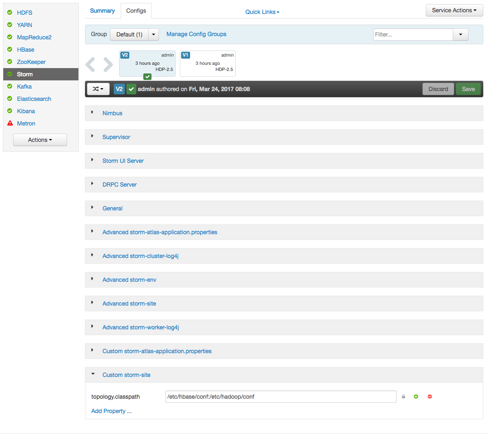
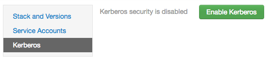
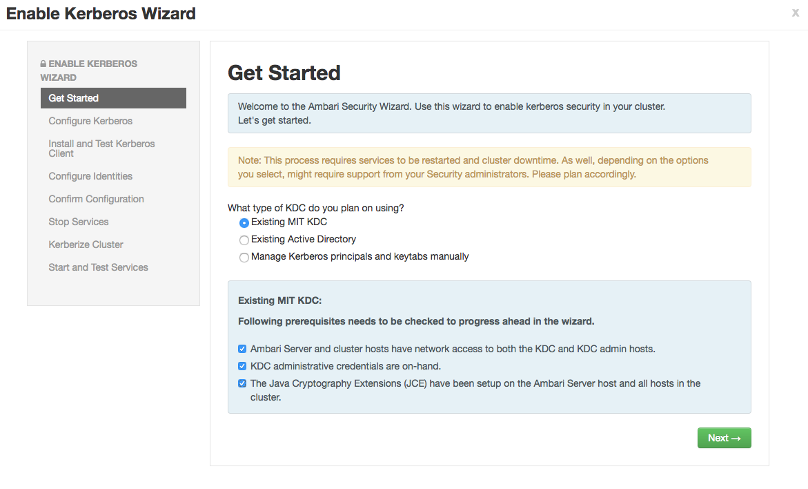

Kerberos Setup
==============

This document provides instructions for kerberizing Metron's Vagrant-based development environments; "Quick Dev" and "Full Dev".  These instructions do not cover the Ambari MPack or sensors.  General Kerberization notes can be found in the metron-deployment [README.md](../README.md).

* [Setup](#setup)
* [Setup a KDC](#setup-a-kdc)
* [Verify KDC](#verify-kdc)
* [Enable Kerberos](#enable-kerberos)
* [Kafka Authorization](#kafka-authorization)
* [HBase Authorization](#hbase-authorization)
* [Storm Authorization](#storm-authorization)
* [Start Metron](#start-metron)
* [Push Data](#push-data)
* [More Information](#more-information)

Setup
-----

1. Deploy a Vagrant development environment; either [Full Dev](full-dev-platform) or [Quick Dev](quick-dev-platform).

1. Export the following environment variables.  These need to be set for the remainder of the instructions. Replace `node1` with the appropriate hosts, if you are running Metron anywhere other than Vagrant.

    ```
    # execute as root
    sudo su -
    export KAFKA_HOME="/usr/hdp/current/kafka-broker"
    export ZOOKEEPER=node1:2181
    export ELASTICSEARCH=node1:9200
    export BROKERLIST=node1:6667
    export HDP_HOME="/usr/hdp/current"
    export KAFKA_HOME="${HDP_HOME}/kafka-broker"
    export METRON_VERSION="0.4.0"
    export METRON_HOME="/usr/metron/${METRON_VERSION}"
    ```

1. Execute the following commands as root.

	```
	sudo su -
	```

1. Stop all Metron topologies.  They will be restarted again once Kerberos has been enabled.

  	```
  	for topology in bro snort enrichment indexing; do
  		storm kill $topology;
  	done
  	```

1. Create the `metron` user's home directory in HDFS.

  	```
  	sudo -u hdfs hdfs dfs -mkdir /user/metron
  	sudo -u hdfs hdfs dfs -chown metron:hdfs /user/metron
  	sudo -u hdfs hdfs dfs -chmod 770 /user/metron
  	```

Setup a KDC
-----------

1. Install dependencies.

  	```
  	yum -y install krb5-server krb5-libs krb5-workstation
  	```

1. Define the host, `node1`, as the KDC.

  	```
  	sed -i 's/kerberos.example.com/node1/g' /etc/krb5.conf
  	cp -f /etc/krb5.conf /var/lib/ambari-server/resources/scripts
  	```

1. Ensure the KDC can issue renewable tickets. This can be necessary on a real cluster, but should not be on full-dev. In /var/kerberos/krb5kdc/kdc.conf ensure the following is in the realm section
   ```
   max_renewable_life = 7d
   ```
 

1. Do not copy/paste this full set of commands as the `kdb5_util` command will not run as expected. Run the commands individually to ensure they all execute.  This step takes a moment. It creates the kerberos database.

  	```
  	kdb5_util create -s

  	/etc/rc.d/init.d/krb5kdc start
  	chkconfig krb5kdc on

  	/etc/rc.d/init.d/kadmin start
  	chkconfig kadmin on
  	```

1. Setup the `admin` and `metron` principals. You'll `kinit` as the `metron` principal when running topologies. Make sure to remember the passwords.

  	```
  	kadmin.local -q "addprinc admin/admin"
  	kadmin.local -q "addprinc metron"
  	```

Verify KDC 
-----------
Ticket renewal is by default disallowed in many linux distributions. If the KDC cannot issue renewable tickets, an error will be thrown when starting Metron's Storm topologies:
   ```
   Exception in thread "main" java.lang.RuntimeException: java.lang.RuntimeException: The TGT found is not renewable
   ```


Ensure the Metron keytab is renewable.  Look for the 'R' flag from the following command
   ```
   klist -f
   ```

If the 'R' flags are present, you may skip to next section.

If the 'R' flags are absent, you will need to follow the below steps:
If the KDC is already setup, then editing max_life and max_renewable_life in ```/var/kerberos/krb5kdc/kdc.conf```, and restarting kadmin and krb5kdc services will not change the policies for existing users. 

You need to set the renew lifetime for existing users and krbtgt realm. Modify the appropriate principals to allow renewable tickets using the following commands. Adjust the parameters to match your desired KDC parameters:
   ```
   kadmin.local -q "modprinc -maxlife 1days -maxrenewlife 7days +allow_renewable krbtgt/EXAMPLE.COM@EXAMPLE.COM"
   kadmin.local -q "modprinc -maxlife 1days -maxrenewlife 7days +allow_renewable metron@EXAMPLE.COM"
   ```


Enable Kerberos
---------------

1. In [Ambari](http://node1:8080), setup Storm to use Kerberos and run worker jobs as the submitting user.

    a. Add the following properties to the custom storm-site:

    ```
    topology.auto-credentials=['org.apache.storm.security.auth.kerberos.AutoTGT']
    nimbus.credential.renewers.classes=['org.apache.storm.security.auth.kerberos.AutoTGT']
    supervisor.run.worker.as.user=true
    ```

    b. In the Storm config section in Ambari, choose “Add Property” under custom storm-site:

    

    c. In the dialog window, choose the “bulk property add mode” toggle button and add the below values:

    

1. Kerberize the cluster via Ambari. More detailed documentation can be found [here](http://docs.hortonworks.com/HDPDocuments/HDP2/HDP-2.5.3/bk_security/content/_enabling_kerberos_security_in_ambari.html).

    a. For this exercise, choose existing MIT KDC (this is what we setup and installed in the previous steps.)

    

    

    b. Setup Kerberos configuration. Realm is EXAMPLE.COM. The admin principal will end up as admin/admin@EXAMPLE.COM when testing the KDC. Use the password you entered during the step for adding the admin principal.

    

    c. Click through to “Start and Test Services.” Let the cluster spin up, but don't worry about starting up Metron via Ambari - we're going to run the parsers manually against the rest of the Hadoop cluster Kerberized. The wizard will fail at starting Metron, but this is OK. Click “continue.” When you’re finished, the custom storm-site should look similar to the following:

    

1. Create a Metron keytab

    ```
  	kadmin.local -q "ktadd -k metron.headless.keytab metron@EXAMPLE.COM"
  	cp metron.headless.keytab /etc/security/keytabs
  	chown metron:hadoop /etc/security/keytabs/metron.headless.keytab
  	chmod 440 /etc/security/keytabs/metron.headless.keytab
  	```

Kafka Authorization
-------------------

1. Acquire a Kerberos ticket using the `metron` principal.

    ```
  	kinit -kt /etc/security/keytabs/metron.headless.keytab metron@EXAMPLE.COM
  	```

1. Create any additional Kafka topics that you will need. We need to create the topics before adding the required ACLs. The current full dev installation will deploy bro, snort, enrichments, and indexing only.  For example, you may want to add a topic for 'yaf' telemetry.

    ```
  	${KAFKA_HOME}/bin/kafka-topics.sh \
      --zookeeper ${ZOOKEEPER} \
      --create \
      --topic yaf \
      --partitions 1 \
      --replication-factor 1
  	```

1. Setup Kafka ACLs for the `bro`, `snort`, `enrichments`, and `indexing` topics.  Run the same command against any additional topics that you might be using; for example `yaf`.

    ```
  	export KERB_USER=metron

  	for topic in bro snort enrichments indexing; do
  		${KAFKA_HOME}/bin/kafka-acls.sh \
          --authorizer kafka.security.auth.SimpleAclAuthorizer \
          --authorizer-properties zookeeper.connect=${ZOOKEEPER} \
          --add \
          --allow-principal User:${KERB_USER} \
          --topic ${topic}
  	done
  	```

1. Setup Kafka ACLs for the consumer groups.  This command sets the ACLs for Bro, Snort, YAF, Enrichments, Indexing, and the Profiler.  Execute the same command for any additional Parsers that you may be running.

    ```
    export KERB_USER=metron

  	for group in bro_parser snort_parser yaf_parser enrichments indexing profiler; do
  		${KAFKA_HOME}/bin/kafka-acls.sh \
          --authorizer kafka.security.auth.SimpleAclAuthorizer \
          --authorizer-properties zookeeper.connect=${ZOOKEEPER} \
          --add \
          --allow-principal User:${KERB_USER} \
          --group ${group}
  	done
  	```

1. Add the `metron` principal to the `kafka-cluster` ACL.

    ```
  	${KAFKA_HOME}/bin/kafka-acls.sh \
        --authorizer kafka.security.auth.SimpleAclAuthorizer \
        --authorizer-properties zookeeper.connect=${ZOOKEEPER} \
        --add \
        --allow-principal User:${KERB_USER} \
        --cluster kafka-cluster
  	```

HBase Authorization
-------------------

1. Acquire a Kerberos ticket using the `hbase` principal

    ```
  	kinit -kt /etc/security/keytabs/hbase.headless.keytab hbase-metron_cluster@EXAMPLE.COM
  	```

1. Grant permissions for the HBase tables used in Metron.

    ```
  	echo "grant 'metron', 'RW', 'threatintel'" | hbase shell
  	echo "grant 'metron', 'RW', 'enrichment'" | hbase shell
  	```

1. If you are using the Profiler, do the same for its HBase table.

    ```
  	echo "create 'profiler', 'P'" | hbase shell
  	echo "grant 'metron', 'RW', 'profiler', 'P'" | hbase shell
  	```

Storm Authorization
-------------------

1. Switch to the `metron` user and acquire a Kerberos ticket for the `metron` principal.

    ```
  	su metron
  	kinit -kt /etc/security/keytabs/metron.headless.keytab metron@EXAMPLE.COM
  	```

1. Create the directory `/home/metron/.storm` and switch to that directory.

    ```
  	mkdir /home/metron/.storm
  	cd /home/metron/.storm
  	```

1. Ensure the Metron keytab is renewable. See [Verify KDC](#verify-kdc) above


1. Create a client JAAS file at `/home/metron/.storm/client_jaas.conf`.  This should look identical to the Storm client JAAS file located at `/etc/storm/conf/client_jaas.conf` except for the addition of a `Client` stanza. The `Client` stanza is used for Zookeeper. All quotes and semicolons are necessary.

    ```
    cat << EOF > client_jaas.conf
    StormClient {
        com.sun.security.auth.module.Krb5LoginModule required
        useTicketCache=true
        renewTicket=true
        serviceName="nimbus";
    };
    Client {
        com.sun.security.auth.module.Krb5LoginModule required
        useKeyTab=true
        keyTab="/etc/security/keytabs/metron.headless.keytab"
        storeKey=true
        useTicketCache=false
        serviceName="zookeeper"
        principal="metron@EXAMPLE.COM";
    };
    KafkaClient {
        com.sun.security.auth.module.Krb5LoginModule required
        useKeyTab=true
        keyTab="/etc/security/keytabs/metron.headless.keytab"
        storeKey=true
        useTicketCache=false
        serviceName="kafka"
        principal="metron@EXAMPLE.COM";
    };
    EOF
    ```

1. Create a YAML file at `/home/metron/.storm/storm.yaml`.  This should point to the client JAAS file.  Set the array of nimbus hosts accordingly.

    ```
    cat << EOF > /home/metron/.storm/storm.yaml
    nimbus.seeds : ['node1']
    java.security.auth.login.config : '/home/metron/.storm/client_jaas.conf'
    storm.thrift.transport : 'org.apache.storm.security.auth.kerberos.KerberosSaslTransportPlugin'
    EOF
    ```

1. Create an auxiliary storm configuration file at `/home/metron/storm-config.json`. Note the login config option in the file points to the client JAAS file.

    ```
    cat << EOF > /home/metron/storm-config.json
    {
        "topology.worker.childopts" : "-Djava.security.auth.login.config=/home/metron/.storm/client_jaas.conf"
    }
    EOF
    ```

1. Configure the Enrichment, Indexing and the Profiler topologies to use the client JAAS file.  Add the following properties to each of the topology properties files.

  	```
  	kafka.security.protocol=PLAINTEXTSASL
  	topology.worker.childopts=-Djava.security.auth.login.config=/home/metron/.storm/client_jaas.conf
  	```

    * `${METRON_HOME}/config/enrichment.properties`
    * `${METRON_HOME}/config/elasticsearch.properties`
    * `${METRON_HOME}/config/profiler.properties`

    Use the following command to automate this step.

    ```
    for file in enrichment.properties elasticsearch.properties profiler.properties; do
      echo ${file}
      sed -i "s/^kafka.security.protocol=.*/kafka.security.protocol=PLAINTEXTSASL/" "${METRON_HOME}/config/${file}"
      sed -i "s/^topology.worker.childopts=.*/topology.worker.childopts=-Djava.security.auth.login.config=\/home\/metron\/.storm\/client_jaas.conf/" "${METRON_HOME}/config/${file}"
    done
    ```

Start Metron
------------

1. Switch to the `metron` user and acquire a Kerberos ticket for the `metron` principal.

    ```
  	su metron
  	kinit -kt /etc/security/keytabs/metron.headless.keytab metron@EXAMPLE.COM
  	```

1. Restart the parser topologies. Be sure to pass in the new parameter, `-ksp` or `--kafka_security_protocol`.  The following command will start only the Bro and Snort topologies.  Execute the same command for any other Parsers that you may need, for example `yaf`.

    ```
    for parser in bro snort; do
       ${METRON_HOME}/bin/start_parser_topology.sh \
               -z ${ZOOKEEPER} \
               -s ${parser} \
               -ksp SASL_PLAINTEXT \
               -e /home/metron/storm-config.json;
    done
    ```

1. Restart the Enrichment and Indexing topologies.

    ```
  	${METRON_HOME}/bin/start_enrichment_topology.sh
  	${METRON_HOME}/bin/start_elasticsearch_topology.sh
  	```

Metron should be ready to receive data.

Push Data
---------
1. Push some sample data to one of the parser topics. E.g for Bro we took raw data from [incubator-metron/metron-platform/metron-integration-test/src/main/sample/data/bro/raw/BroExampleOutput](../metron-platform/metron-integration-test/src/main/sample/data/bro/raw/BroExampleOutput)

    ```
  	cat sample-bro.txt | ${KAFKA_HOME}/kafka-broker/bin/kafka-console-producer.sh \
  	        --broker-list ${BROKERLIST}
          	--security-protocol SASL_PLAINTEXT \
            --topic bro
  	```

1. Wait a few moments for data to flow through the system and then check for data in the Elasticsearch indices. Replace yaf with whichever parser type you’ve chosen.

    ```
  	curl -XGET "${ELASTICSEARCH}/bro*/_search"
  	curl -XGET "${ELASTICSEARCH}/bro*/_count"
  	```

1. You should have data flowing from the parsers all the way through to the indexes. This completes the Kerberization instructions

More Information
----------------

### Kerberos

Unsure of your Kerberos principal associated with a keytab? There are a couple ways to get this. One is via the list of principals that Ambari provides via downloadable csv. If you didn’t download this list, you can also check the principal manually by running the following against the keytab.

```
klist -kt /etc/security/keytabs/<keytab-file-name>
```

E.g.

```
klist -kt /etc/security/keytabs/hbase.headless.keytab
Keytab name: FILE:/etc/security/keytabs/hbase.headless.keytab
KVNO Timestamp         Principal
---- ----------------- --------------------------------------------------------
   1 03/28/17 19:29:36 hbase-metron_cluster@EXAMPLE.COM
   1 03/28/17 19:29:36 hbase-metron_cluster@EXAMPLE.COM
   1 03/28/17 19:29:36 hbase-metron_cluster@EXAMPLE.COM
   1 03/28/17 19:29:36 hbase-metron_cluster@EXAMPLE.COM
   1 03/28/17 19:29:36 hbase-metron_cluster@EXAMPLE.COM
```

### Kafka with Kerberos enabled

#### Write data to a topic with SASL

```
cat sample-yaf.txt | ${KAFKA_HOME}/bin/kafka-console-producer.sh \
        --broker-list ${BROKERLIST} \
        --security-protocol PLAINTEXTSASL \
        --topic yaf
```

#### View topic data from latest offset with SASL

```
${KAFKA_HOME}/bin/kafka-console-consumer.sh \
        --zookeeper ${ZOOKEEPER} \
        --security-protocol PLAINTEXTSASL \
        --topic yaf
```

#### Modify the sensor-stubs to send logs via SASL
```
sed -i 's/node1:6667 --topic/node1:6667 --security-protocol PLAINTEXTSASL --topic/' /opt/sensor-stubs/bin/start-*-stub
for sensorstub in bro snort; do
    service sensor-stubs stop ${sensorstub};
    service sensor-stubs start ${sensorstub};
done
```

### References

* [https://github.com/apache/storm/blob/master/SECURITY.md](https://github.com/apache/storm/blob/master/SECURITY.md)
