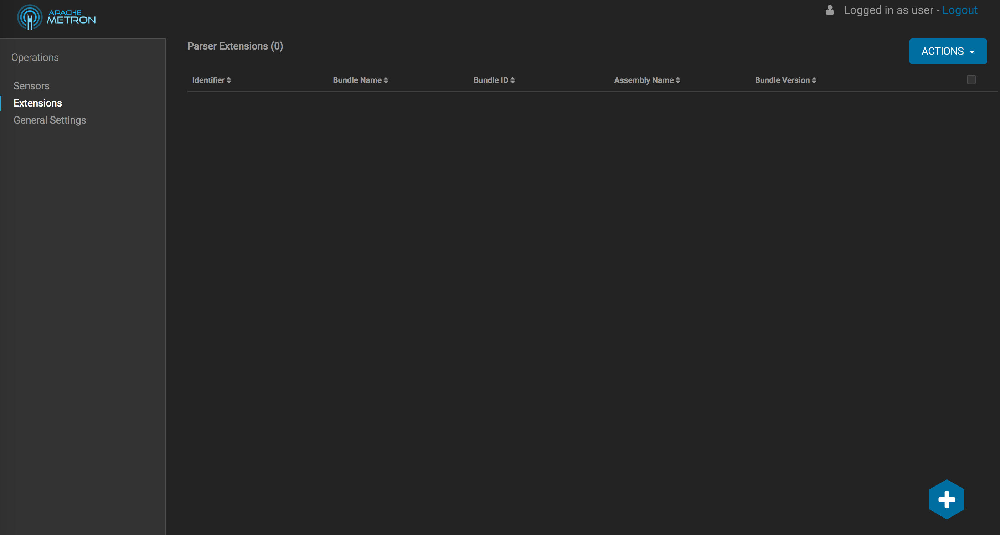
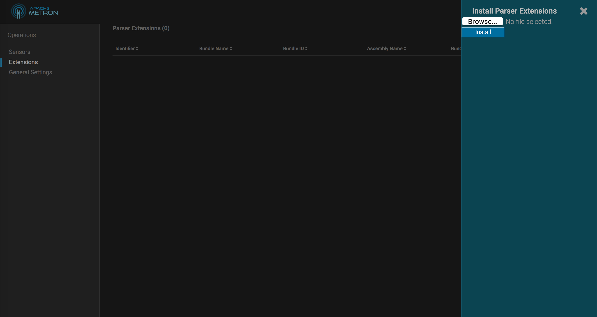
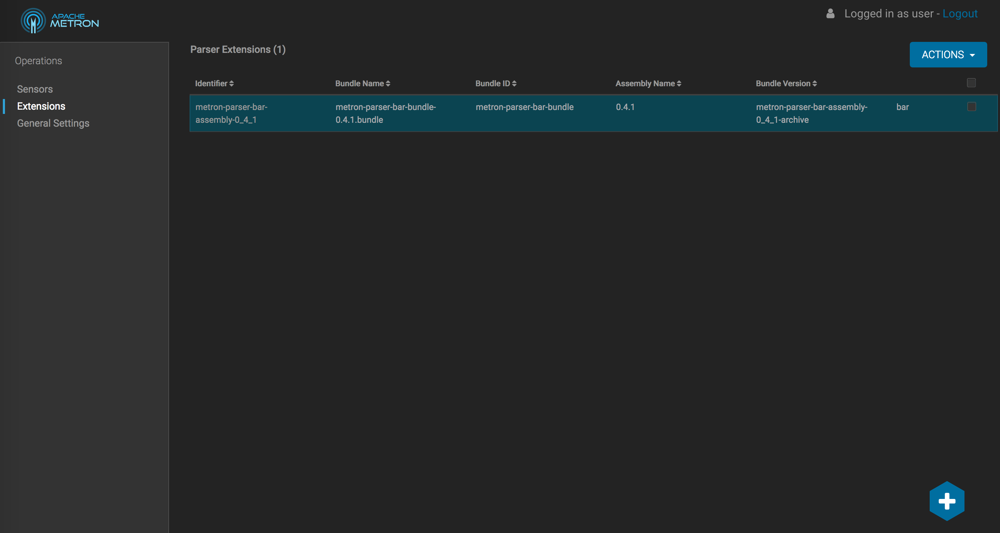
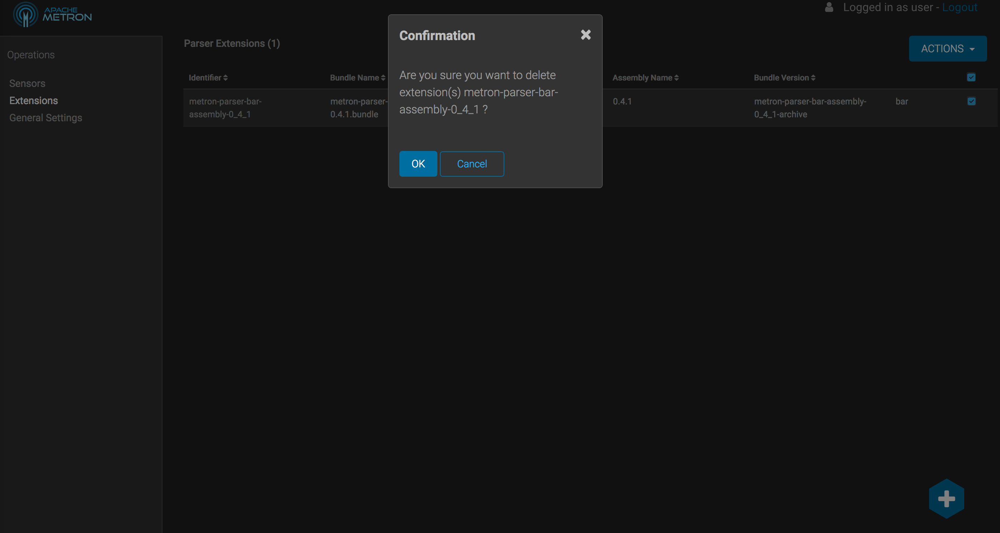

#Installing Parser Extensions with Metron Configuration Management UI

### start full_dev
- run vagrant up from metron-deployment/vagrant/full_dev_platform

### add a slot to storm
- log into ambari on http://node1:8080
- add a new slot to the storm config

### Open Metron Configuration Management UI
- log into ambari on http://node1:4200
- select extensions from the left side navigation list

### Install your parser
In the ui, click on the plus sign in the bottom right hand corner to open the extension installation ui.

- click the browse button
- use the file selector to select the created .tar.gz
- click install
The extension should now be installed:

- you should be able to view the installed files in hdfs/apps/metron/patterns/{parsername}, hdfs/apps/metron/extensions_alt_lib/

### View the installed parser(s)
- select sensors from the left side navigation list
- you will see any parsers from the extension now installed and listed

### Open swagger
- log into ambari on http://node1:8080
- go into the metron service | quicklinks
- start swagger with user | password

### Create a kafka topic
In swagger
- Use the Kafka Controller and the Storm Controller to create a {parserName} topic

### Start an instance of your parser
In the Metron Configuration Management UI
- click the start arrow to start your parser

### Uninstall your parser
In the Metron Configuration Management UI
- stop any running parsers
- delete any created kafka topics in swagger
- select extensions from the left side navigation list
- check the box for the extension to uninstall 
- from the Actions dropdown, select delete

