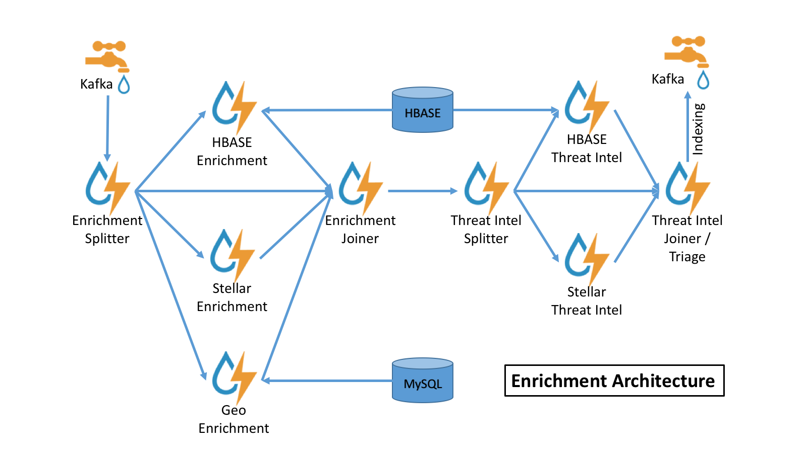

<!--
Licensed to the Apache Software Foundation (ASF) under one
or more contributor license agreements.  See the NOTICE file
distributed with this work for additional information
regarding copyright ownership.  The ASF licenses this file
to you under the Apache License, Version 2.0 (the
"License"); you may not use this file except in compliance
with the License.  You may obtain a copy of the License at

    http://www.apache.org/licenses/LICENSE-2.0

Unless required by applicable law or agreed to in writing, software
distributed under the License is distributed on an "AS IS" BASIS,
WITHOUT WARRANTIES OR CONDITIONS OF ANY KIND, either express or implied.
See the License for the specific language governing permissions and
limitations under the License.
-->
# Enrichment

## Introduction

The `enrichment` topology is a topology dedicated to taking the data
from the parsing topologies that have been normalized into the Metron
data format (e.g. a JSON Map structure with `original_message` and
`timestamp`) and 
* Enriching messages with external data from data stores (e.g. hbase) by
  adding new fields based on existing fields in the messages.
* Marking messages as threats based on data in external data stores
* Marking threat alerts with a numeric triage level based on a set of
  Stellar rules.

## Enrichment Architecture



### Unified Enrichment Topology

There is an experimental unified enrichment topology which is shipped.
Currently the architecture, as described above, has a split/join in
order to perform enrichments in parallel.  This poses some issues in
terms of ease of tuning and reasoning about performance.  

In order to deal with these issues, there is an alternative enrichment topology which
uses data parallelism as opposed to the split/join task parallelism.
This architecture uses a worker pool to fully enrich any message within 
a worker.  This results in 
* Fewer bolts in the topology 
* Each bolt fully operates on a message.
* Fewer network hops

#### Using It

In order to use this, you will need to 
* Edit `$METRON_HOME/bin/start_enrichment_topology.sh` and adjust it to use `remote-unified.yaml` instead of `remote.yaml`
* Restart the enrichment topology.

#### Configuring It

There are two parameters which you might want to tune in this topology.
Both of them are topology configuration adjustable in the flux file
`$METRON_HOME/config/flux/enrichment/remote-unified.yaml`:
* `metron.threadpool.size` : The size of the threadpool.  This can take a number or a multiple of the number of cores (e.g. `5C` to 5 times the number of cores).  The default is `2C`.
* `metron.threadpool.type` : The type of threadpool. (note: descriptions taken from [here](https://zeroturnaround.com/rebellabs/fixedthreadpool-cachedthreadpool-or-forkjoinpool-picking-correct-java-executors-for-background-tasks/)).
   * `FIXED` is a fixed threadpool of size `n`. `n` threads will process tasks at the time, when the pool is saturated, new tasks will get added to a queue without a limit on size. Good for CPU intensive tasks.  This is the default.
   * `WORK_STEALING` is a work stealing threadpool.  This will create and shut down threads dynamically to accommodate the required parallelism level. It also tries to reduce the contention on the task queue, so can be really good in heavily loaded environments. Also good when your tasks create more tasks for the executor, like recursive tasks.

In order to configure the parallelism for the enrichment bolt and threat
intel bolt, the configurations will be taken from the respective join bolt
parallelism.  When proper ambari support for this is added, we will add
its own property.

## Enrichment Configuration

The configuration for the `enrichment` topology, the topology primarily
responsible for enrichment and threat intelligence enrichment, is
defined by JSON documents stored in zookeeper.

There are two types of configurations at the moment, `global` and
`sensor` specific.  


## Global Configuration 

There are a few enrichments which have independent configurations, such
as from the global config.

Also, see the "[Global Configuration](../metron-common)" section for
more discussion of the global config.

### GeoIP
Metron supports enrichment of IP information using
[GeoLite2](https://dev.maxmind.com/geoip/geoip2/geolite2/). The
location of the file is managed in the global config.

#### `geo.hdfs.file`

The location on HDFS of the GeoLite2 database file to use for GeoIP
lookups.  This file will be localized on the storm supervisors running
the topology and used from there. This is lazy, so if this property
changes in a running topology, the file will be localized from HDFS upon first
time the file is used via the geo enrichment. 

## Sensor Enrichment Configuration

The sensor specific configuration is intended to configure the
individual enrichments and threat intelligence enrichments for a given
sensor type (e.g. `snort`).

Just like the global config, the format is a JSON stored in zookeeper.
The configuration is a complex JSON object with the following top level fields:

* `enrichment` : A complex JSON object representing the configuration of the enrichments
* `threatIntel` : A complex JSON object representing the configuration of the threat intelligence enrichments

### The `enrichment` Configuration


| Field            | Description                                                                                                                                                                                                                   | Example                                                          |
|------------------|-------------------------------------------------------------------------------------------------------------------------------------------------------------------------------------------------------------------------------|------------------------------------------------------------------|
| `fieldToTypeMap` | In the case of a simple HBase enrichment (i.e. a key/value lookup), the mapping between fields and the enrichment types associated with those fields must be known.  This enrichment type is used as part of the HBase key. Note: applies to hbaseEnrichment only. | `"fieldToTypeMap" : { "ip_src_addr" : [ "asset_enrichment" ] }`  |
| `fieldMap`       | The map of enrichment bolts names to configuration handlers which know how to split the message up.  The simplest of which is just a list of fields.  More complex examples would be the stellar enrichment which provides stellar statements. Each field listed in the array arg is sent to the enrichment referenced in the key. Cardinality of fields to enrichments is many-to-many. | `"fieldMap": {"hbaseEnrichment": ["ip_src_addr","ip_dst_addr"]}` |
| `config`         | The general configuration for the enrichment                                                                                                                                                                                  | `"config": {"typeToColumnFamily": { "asset_enrichment" : "cf" } }` |

The `config` map is intended to house enrichment specific configuration.
For instance, for the `hbaseEnrichment`, the mappings between the
enrichment types to the column families is specified.

The `fieldMap`contents are of interest because they contain the routing and configuration information for the enrichments.  
When we say 'routing', we mean how the messages get split up and sent to the enrichment adapter bolts.  
The simplest, by far, is just providing a simple list as in
```
    "fieldMap": {
      "geo": [
        "ip_src_addr",
        "ip_dst_addr"
      ],
      "host": [
        "ip_src_addr",
        "ip_dst_addr"
      ],
      "hbaseEnrichment": [
        "ip_src_addr",
        "ip_dst_addr"
      ]
      }
```
Based on this sample config, both `ip_src_addr` and `ip_dst_addr` will go to the `geo`, `host`, and 
`hbaseEnrichment` adapter bolts. 
 
#### Stellar Enrichment Configuration
For the `geo`, `host` and `hbaseEnrichment`, this is sufficient. However, more complex enrichments 
may contain their own configuration.  Currently, the `stellar` enrichment is more adaptable and thus
requires a more nuanced configuration.

At its most basic, we want to take a message and apply a couple of enrichments, such as converting the
`hostname` field to lowercase. We do this by specifying the transformation inside of the 
`config` for the `stellar` fieldMap.  There are two syntaxes that are supported, specifying the transformations
as a map with the key as the field and the value the stellar expression:
```
    "fieldMap": {
       ...
      "stellar" : {
        "config" : {
          "hostname" : "TO_LOWER(hostname)"
        }
      }
    }
```

Another approach is to make the transformations as a list with the same `var := expr` syntax as is used
in the Stellar REPL, such as:
```
    "fieldMap": {
       ...
      "stellar" : {
        "config" : [
          "hostname := TO_LOWER(hostname)"
        ]
      }
    }
```

Sometimes arbitrary stellar enrichments may take enough time that you would prefer to split some of them
into groups and execute the groups of stellar enrichments in parallel.  Take, for instance, if you wanted
to do an HBase enrichment and a profiler call which were independent of one another.  This usecase is 
supported by splitting the enrichments up as groups.

Consider the following example:
```
    "fieldMap": {
       ...
      "stellar" : {
        "config" : {
          "malicious_domain_enrichment" : {
            "is_bad_domain" : "ENRICHMENT_EXISTS('malicious_domains', ip_dst_addr, 'enrichments', 'cf')"
          },
          "login_profile" : [
            "profile_window := PROFILE_WINDOW('from 6 months ago')", 
            "global_login_profile := PROFILE_GET('distinct_login_attempts', 'global', profile_window)",
            "stats := STATS_MERGE(global_login_profile)",
            "auth_attempts_median := STATS_PERCENTILE(stats, 0.5)", 
            "auth_attempts_sd := STATS_SD(stats)",
            "profile_window := null", 
            "global_login_profile := null", 
            "stats := null"
          ]
        }
      }
    }
```

Here we want to perform two enrichments that hit HBase and we would rather not run in sequence.  These
enrichments are entirely independent of one another (i.e. neither relies on the output of the other).  In
this case, we've created a group called `malicious_domain_enrichment` to inquire about whether the destination
address exists in the HBase enrichment table in the `malicious_domains` enrichment type.  This is a simple
enrichment, so we can express the enrichment group as a map with the new field `is_bad_domain` being a key
and the stellar expression associated with that operation being the associated value.

In contrast, the stellar enrichment group `login_profile` is interacting with the profiler, has multiple temporary
expressions (i.e. `profile_window`, `global_login_profile`, and `stats`) that are useful only within the context
of this group of stellar expressions.  In this case, we would need to ensure that we use the list construct
when specifying the group and remember to set the temporary variables to `null` so they are not passed along.

In general, things to note from this section are as follows:
* The stellar enrichments for the `stellar` enrichment adapter are specified in the `config` for the `stellar` enrichment
adapter in the `fieldMap`
* Groups of independent (i.e. no expression in any group depend on the output of an expression from an other group) may be executed in parallel
* If you have the need to use temporary variables, you may use the list construct.  Ensure that you assign the variables to `null` before the end of the group.
* **Ensure that you do not assign a field to a stellar expression which returns an object which JSON cannot represent.**
* Fields assigned to Maps as part of stellar enrichments have the maps unfolded, similar to the HBase Enrichment
  * For example the stellar enrichment for field `foo` which assigns a map such as `foo := { 'grok' : 1, 'bar' : 'baz'}`
  would yield the following fields:
    * `foo.grok` == `1`
    * `foo.bar` == `'baz'`

### The `threatIntel` Configuration

| Field            | Description                                                                                                                                                                                                                                   | Example                                                                  |
|------------------|-----------------------------------------------------------------------------------------------------------------------------------------------------------------------------------------------------------------------------------------------|--------------------------------------------------------------------------|
| `fieldToTypeMap` | In the case of a simple HBase threat intel enrichment (i.e. a key/value lookup), the mapping between fields and the enrichment types associated with those fields must be known.  This enrichment type is used as part of the HBase key. Note: applies to hbaseThreatIntel only. | `"fieldToTypeMap" : { "ip_src_addr" : [ "malicious_ips" ] }`             |
| `fieldMap`       | The map of threat intel enrichment bolts names to fields in the JSON messages. Each field is sent to the threat intel enrichment bolt referenced in the key. Each field listed in the array arg is sent to the enrichment referenced in the key. Cardinality of fields to enrichments is many-to-many.                                                     | `"fieldMap": {"hbaseThreatIntel": ["ip_src_addr","ip_dst_addr"]}`        |
| `triageConfig`   | The configuration of the threat triage scorer.  In the situation where a threat is detected, a score is assigned to the message and embedded in the indexed message.                                                                    | `"riskLevelRules" : { "IN_SUBNET(ip_dst_addr, '192.168.0.0/24')" : 10 }` |
| `config`         | The general configuration for the Threat Intel                                                                                                                                                                                                | `"config": {"typeToColumnFamily": { "malicious_ips","cf" } }`            |

The `config` map is intended to house threat intel specific configuration.
For instance, for the `hbaseThreatIntel` threat intel adapter, the mappings between the
enrichment types to the column families is specified.  The `fieldMap` configuration is similar to the `enrichment`
configuration in that the adapters available are the same.

The `triageConfig` field is also a complex field and it bears some description:

| Field            | Description                                                                                                                                             | Example                                                                  |
|------------------|---------------------------------------------------------------------------------------------------------------------------------------------------------|--------------------------------------------------------------------------|
| `riskLevelRules` | This is a list of rules (represented as Stellar expressions) associated with scores with optional names and comments                                    |  see below|
| `aggregator`     | An aggregation function that takes all non-zero scores representing the matching queries from `riskLevelRules` and aggregates them into a single score. | `"MAX"`                                                                  |

A risk level rule is of the following format:
* `name` : The name of the threat triage rule
* `comment` : A comment describing the rule
* `rule` : The rule, represented as a Stellar statement
* `score` : Associated threat triage score for the rule
* `reason` : Reason the rule tripped. Can be represented as a Stellar statement

An example of a rule is as follows:
```
    "riskLevelRules" : [ 
        { 
          "name" : "is internal"
        , "comment" : "determines if the destination is internal."
        , "rule" : "IN_SUBNET(ip_dst_addr, '192.168.0.0/24')"
        , "score" : 10
        , "reason" : "FORMAT('%s is internal', ip_dst_addr)"
        }
                       ]
```

The supported aggregation functions are:
* `MAX` : The max of all of the associated values for matching queries
* `MIN` : The min of all of the associated values for matching queries
* `MEAN` : The mean of all of the associated values for matching queries
* `SUM` : The sum of all the associated values for matching queries
* `POSITIVE_MEAN` : The mean of the positive associated values for the matching queries.

### Example Configuration

An example configuration for the YAF sensor is as follows:
```json
{
  "enrichment": {
    "fieldMap": {
      "geo": [
        "ip_src_addr",
        "ip_dst_addr"
      ],
      "host": [
        "ip_src_addr",
        "ip_dst_addr"
      ],
      "hbaseEnrichment": [
        "ip_src_addr",
        "ip_dst_addr"
      ]
    }
  ,"fieldToTypeMap": {
      "ip_src_addr": [
        "playful_classification"
      ],
      "ip_dst_addr": [
        "playful_classification"
      ]
    }
  },
  "threatIntel": {
    "fieldMap": {
      "hbaseThreatIntel": [
        "ip_src_addr",
        "ip_dst_addr"
      ]
    },
    "fieldToTypeMap": {
      "ip_src_addr": [
        "malicious_ip"
      ],
      "ip_dst_addr": [
        "malicious_ip"
      ]
    },
    "triageConfig" : {
      "riskLevelRules" : [ 
        {
          "rule" : "ip_src_addr == '10.0.2.3' or ip_dst_addr == '10.0.2.3'",
          "score" : 10
        }
      ],
      "aggregator" : "MAX"
    }
  }
}
```

ThreatIntel alert levels are emitted as a new field "threat.triage.level." So for the example above, an incoming message that trips the `ip_src_addr` rule will have a new field threat.triage.level=10.


# Example Enrichment via Stellar

Let's walk through doing a simple enrichment using Stellar on your cluster using the Squid topology.

## Install Prerequisites
Now let's install some prerequisites:
* Squid client via `yum install squid`
* ES Head plugin via `/usr/share/elasticsearch/bin/plugin install mobz/elasticsearch-head`

Start Squid via `service squid start`

## Adjust Enrichment Configurations for Squid to Call Stellar
Let's adjust the configurations for the Squid topology to annotate the messages using some Stellar functions.

* Edit the squid enrichment configuration at `$METRON_HOME/config/zookeeper/enrichments/squid.json` (this file will not exist, so create a new one) to add some new fields based on stellar queries: 

 ```
{
  "enrichment" : {
    "fieldMap": {
      "stellar" : {
        "config" : {
          "numeric" : {
                      "foo": "1 + 1"
                      }
          ,"ALL_CAPS" : "TO_UPPER(source.type)"
        }
      }
     }
  },
  "threatIntel" : {
    "fieldMap":{
     "stellar" : {
        "config" : {
          "bar" : "TO_UPPER(source.type)"
        }
      } 
    },
    "triageConfig" : {
    }
  }
}
```
We have added the following fields as part of the enrichment phase of the enrichment topology:
* `foo` ==  2
* `ALL_CAPS` == SQUID 

We have added the following as part of the threat intel:
* ` bar` == SQUID

Please note that foo and ALL_CAPS will be applied in separate workers due to them being in separate groups.

* Upload new configs via `$METRON_HOME/bin/zk_load_configs.sh --mode PUSH -i $METRON_HOME/config/zookeeper -z node1:2181`
* Make the Squid topic in kafka via `/usr/hdp/current/kafka-broker/bin/kafka-topics.sh --zookeeper node1:2181 --create --topic squid --partitions 1 --replication-factor 1`

## Start Topologies and Send Data
Now we need to start the topologies and send some data:
* Start the squid topology via `$METRON_HOME/bin/start_parser_topology.sh -k node1:6667 -z node1:2181 -s squid`
* Generate some data via the squid client:
  * `squidclient http://yahoo.com`
  * `squidclient http://cnn.com`
* Send the data to kafka via `cat /var/log/squid/access.log | /usr/hdp/current/kafka-broker/bin/kafka-console-producer.sh --broker-list node1:6667 --topic squid`
* Browse the data in elasticsearch via the ES Head plugin @ [http://node1:9200/_plugin/head/](http://node1:9200/_plugin/head/) and verify that in the squid index you have two documents
* Ensure that the documents have new fields `foo`, `bar` and `ALL_CAPS` with values as described above.

Note that we could have used any Stellar statements here, including calling out to HBase via `ENRICHMENT_GET` and `ENRICHMENT_EXISTS` or even calling a machine learning model via [Model as a Service](../../metron-analytics/metron-maas-service).


