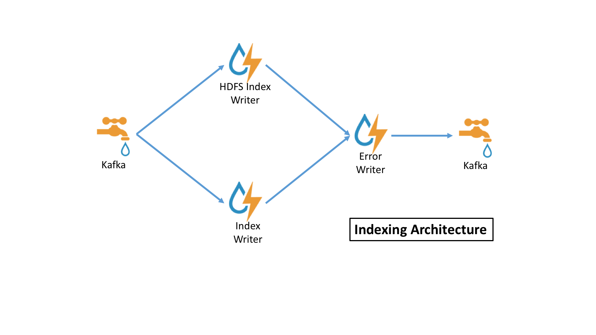

<!--
Licensed to the Apache Software Foundation (ASF) under one
or more contributor license agreements.  See the NOTICE file
distributed with this work for additional information
regarding copyright ownership.  The ASF licenses this file
to you under the Apache License, Version 2.0 (the
"License"); you may not use this file except in compliance
with the License.  You may obtain a copy of the License at

    http://www.apache.org/licenses/LICENSE-2.0

Unless required by applicable law or agreed to in writing, software
distributed under the License is distributed on an "AS IS" BASIS,
WITHOUT WARRANTIES OR CONDITIONS OF ANY KIND, either express or implied.
See the License for the specific language governing permissions and
limitations under the License.
-->
# Indexing

## Introduction

The `indexing` topology is a topology dedicated to taking the data
from the enrichment topology that have been enriched and storing the data in one or more supported indices
* HDFS as rolled text files, one JSON blob per line
* Elasticsearch
* Solr

By default, this topology writes out to both HDFS and one of
Elasticsearch and Solr.

Indices are written in batch and the batch size and batch timeout are specified in the
[Sensor Indexing Configuration](#sensor-indexing-configuration) via the `batchSize` and `batchTimeout` parameters.
These configs are variable by sensor type.

## Minimal Assumptions for Message Structure

At minimum, a message should have a `source.type` field.
Without this field, the message tuple will be failed and not written
with an appropriate error indicated in the Storm UI and logs.

## Indexing Architecture



The indexing topology is extremely simple.  Data is ingested into kafka
and sent to 
* An indexing bolt configured to write to either elasticsearch or Solr
* An indexing bolt configured to write to HDFS under `/apps/metron/enrichment/indexed`

By default, errors during indexing are sent back into the `indexing` kafka queue so that they can be indexed and archived.

## Sensor Indexing Configuration
The sensor specific configuration is intended to configure the
indexing used for a given sensor type (e.g. `snort`).  

Just like the global config, the format is a JSON stored in zookeeper and on disk at `$METRON_HOME/config/zookeeper/indexing`.  Within the sensor-specific configuration, you can configure the individual writers.  The writers currently supported are:
* `elasticsearch`
* `hdfs`
* `solr`

Depending on how you start the indexing topology, it will have either
elasticsearch or solr and hdfs writers running.

The configuration for an individual writer-specific configuration is a JSON map with the following fields:
* `index` : The name of the index to write to (defaulted to the name of the sensor).
* `batchSize` : The size of the batch that is written to the indices at once. Defaults to `1` (no batching).
* `batchTimeout` : The timeout after which a batch will be flushed even if batchSize has not been met.  Optional.
If unspecified, or set to `0`, it defaults to a system-determined duration which is a fraction of the Storm 
parameter `topology.message.timeout.secs`.  Ignored if batchSize is `1`, since this disables batching.
* `enabled` : Whether the writer is enabled (default `true`).

### Meta Alerts
Alerts can be grouped, after appropriate searching, into a set of alerts called a meta alert.  A meta alert is useful for maintaining the context of searching and grouping during further investigations. Standard searches can return meta alerts, but grouping and other aggregation or sorting requests will not, because there's not a clear way to aggregate in many cases if there are multiple alerts contained in the meta alert. All meta alerts will have the source type of metaalert, regardless of the contained alert's origins.

### Elasticsearch
Metron comes with built-in templates for the default sensors for Elasticsearch. When adding a new sensor, it will be necessary to add a new template defining the output fields appropriately. In addition, there is a requirement for a field `alert` of type `nested` for Elasticsearch 2.x installs.  This is detailed at [Using Metron with Elasticsearch 2.x](../metron-elasticsearch/README.md#using-metron-with-elasticsearch-2x)

### Indexing Configuration Examples
For a given  sensor, the following scenarios would be indicated by
the following cases:
#### Base Case
```
{
}
```
or no file at all.

* elasticsearch writer
  * enabled
  * batch size of 1
  * batch timeout system default
  * index name the same as the sensor
* hdfs writer
  * enabled
  * batch size of 1
  * batch timeout system default
  * index name the same as the sensor

If a writer config is unspecified, then a warning is indicated in the
Storm console.  e.g.:
`WARNING: Default and (likely) unoptimized writer config used for hdfs writer and sensor squid`

#### Fully specified
```
{
   "elasticsearch": {
      "index": "foo",
      "batchSize" : 100,
      "batchTimeout" : 0,
      "enabled" : true 
    },
   "hdfs": {
      "index": "foo",
      "batchSize": 1,
      "batchTimeout" : 0,
      "enabled" : true
    }
}
```
* elasticsearch writer
  * enabled
  * batch size of 100
  * batch timeout system default
  * index name of "foo"
* hdfs writer
  * enabled
  * batch size of 1
  * batch timeout system default
  * index name of "foo"

#### HDFS Writer turned off
```
{
   "elasticsearch": {
      "index": "foo",
      "enabled" : true 
    },
   "hdfs": {
      "index": "foo",
      "batchSize": 100,
      "batchTimeout" : 0,
      "enabled" : false
    }
}
```
* elasticsearch writer
  * enabled
  * batch size of 1
  * batch timeout system default
  * index name of "foo"
* hdfs writer
  * disabled

# Updates to Indexed Data

There are clear usecases where we would want to incorporate the capability to update indexed data.
Thus far, we have limited capabilities provided to support this use-case:
* Updates to the random access index (e.g. Elasticsearch and Solr) should be supported
* Updates to the cold storage index (e.g. HDFS) is not supported currently, however to support the batch
use-case updated documents will be provided in a NoSQL write-ahead log (e.g. a HBase table) and an Java API
will be provided to retrieve those updates scalably (i.e. a scan-free architecture).

Put simply, the random access index will be always up-to-date, but the HDFS index will need to be
joined to the NoSQL write-ahead log to get current updates.

## The `IndexDao` Abstraction

The indices mentioned above as part of Update should be pluggable by the developer so that
new write-ahead logs or real-time indices can be supported by providing an implementation supporting
the data access patterns.

To support a new index, one would need to implement the `org.apache.metron.indexing.dao.IndexDao` abstraction
and provide update and search capabilities.  IndexDaos may be composed and updates will be performed
in parallel.  This enables a flexible strategy for specifying your backing store for updates at runtime.
For instance, currently the REST API supports the update functionality and may be configured with a list of
IndexDao implementations to use to support the updates.

Updates with the IndexDao.update method replace the current object with the new object.  For partial updates,
use IndexDao.patch instead.

### The `HBaseDao`

Updates will be written to HBase. The key structure includes the GUID and sensor type and
for each new version, a new column is created with value as the message.

The HBase table and column family are configured via fields in the global configuration.

#### `update.hbase.table`
The HBase table to use for message updates.

#### `update.hbase.cf`
The HBase column family to use for message updates.

### The `MetaAlertDao`

The goal of meta alerts is to be able to group together a set of alerts while being able to transparently perform actions
like searches, as if meta alerts were normal alerts.  `org.apache.metron.indexing.dao.MetaAlertDao` extends `IndexDao` and
enables several features: 
* the ability to get all meta alerts associated with an alert
* creation of a meta alert
* adding alerts to a meta alert
* removing alerts from a meta alert
* changing a meta alert's status

The implementation of this is to denormalize the relationship between alerts and meta alerts, and store alerts as a nested field within a meta alert.
The use of nested fields is to avoid the limitations of parent-child relationships (one-to-many) and merely linking by IDs
(which causes issues with pagination as a result of being unable to join indices).  A list of containing meta alerts is stored 
on an alert for the purpose of keeping source alerts and alerts contained in meta alerts in sync.

The search functionality of `IndexDao` is wrapped by the `MetaAlertDao` in order to provide both regular and meta alerts side-by-side with sorting.
The updating capabilities are similarly wrapped, in order to ensure updates are carried through both the alerts and associated meta alerts.
Both of these functions are handled under the hood.

In addition, API endpoints have been added to expose the features listed above.
The denormalization handles the case of going from meta alert to alert automatically.

# Notes on Performance Tuning

Default installed Metron is untuned for production deployment.  By far
and wide, the most likely piece to require TLC from a performance
perspective is the indexing layer.  An index that does not keep up will
back up and you will see errors in the kafka bolt.  There
are a few knobs to tune to get the most out of your system.

## Kafka Queue
The `indexing` kafka queue is a collection point from the enrichment
topology.  As such, make sure that the number of partitions in
the kafka topic is sufficient to handle the throughput that you expect.

## Indexing Topology
The `indexing` topology as started by the `$METRON_HOME/bin/start_elasticsearch_topology.sh` 
or `$METRON_HOME/bin/start_solr_topology.sh`
script uses a default of one executor per bolt.  In a real production system, this should 
be customized by modifying the flux file in
`$METRON_HOME/flux/indexing/remote.yaml`. 
* Add a `parallelism` field to the bolts to give Storm a parallelism
  hint for the various components.  Give bolts which appear to be bottlenecks (e.g. the indexing bolt) a larger hint.
* Add a `parallelism` field to the kafka spout which matches the number of partitions for the enrichment kafka queue.
* Adjust the number of workers for the topology by adjusting the 
  `topology.workers` field for the topology. 

Finally, if workers and executors are new to you or you don't know where
to modify the flux file, the following might be of use to you:
* [Understanding the Parallelism of a Storm Topology](http://www.michael-noll.com/blog/2012/10/16/understanding-the-parallelism-of-a-storm-topology/)
* [Flux Docs](http://storm.apache.org/releases/current/flux.html)

### Rest endpoints
There are rest endpoints available to perform operations like start, stop, activate, deactivate on the `indexing` topologies.


|            |
| ---------- |
| [ `GET /api/v1/storm/indexing/batch`](../../metron-interface/metron-rest/README.md#get-apiv1stormindexingbatch)|
| [ `GET /api/v1/storm/indexing/batch/activate`](../../metron-interface/metron-rest/README.md#get-apiv1stormindexingbatchactivate)|
| [ `GET /api/v1/storm/indexing/batch/deactivate`](../../metron-interface/metron-rest/README.md#get-apiv1stormindexingbatchdeactivate)|
| [ `GET /api/v1/storm/indexing/batch/start`](../../metron-interface/metron-rest/README.md#get-apiv1stormindexingbatchstart)|
| [ `GET /api/v1/storm/indexing/batch/stop`](../../metron-interface/metron-rest/README.md#get-apiv1stormindexingbatchstop)|
| [ `GET /api/v1/storm/indexing/randomaccess`](../../metron-interface/metron-rest/README.md#get-apiv1stormindexingrandomaccess)|
| [ `GET /api/v1/storm/indexing/randomaccess/activate`](../../metron-interface/metron-rest/README.md#get-apiv1stormindexingrandomaccessactivate)|
| [ `GET /api/v1/storm/indexing/randomaccess/deactivate`](../../metron-interface/metron-rest/README.md#get-apiv1stormindexingrandomaccessdeactivate)|
| [ `GET /api/v1/storm/indexing/randomaccess/start`](../../metron-interface/metron-rest/README.md#get-apiv1stormindexingrandomaccessstart)|
| [ `GET /api/v1/storm/indexing/randomaccess/stop`](../../metron-interface/metron-rest/README.md#get-apiv1stormindexingrandomaccessstop)|


## Zeppelin Notebooks
Zeppelin notebooks can be added to `/src/main/config/zeppelin/` (and subdirectories can be created for organization).  The placed files must be .json files and be named appropriately.
These files must be added to the metron.spec file and the RPMs rebuilt to be available to be loaded into Ambari.

The notebook files will be found on the server in `$METRON_HOME/config/zeppelin`

The Ambari Management Pack has a custom action to load these templates, ZEPPELIN_DASHBOARD_INSTALL, that will import them into Zeppelin.
