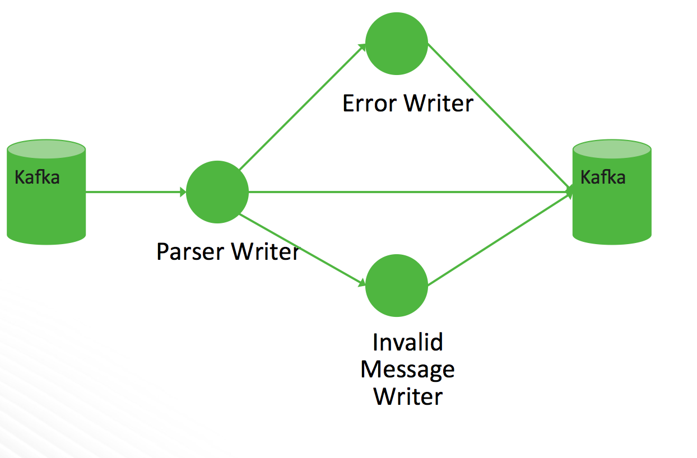

<!--
Licensed to the Apache Software Foundation (ASF) under one
or more contributor license agreements.  See the NOTICE file
distributed with this work for additional information
regarding copyright ownership.  The ASF licenses this file
to you under the Apache License, Version 2.0 (the
"License"); you may not use this file except in compliance
with the License.  You may obtain a copy of the License at

    http://www.apache.org/licenses/LICENSE-2.0

Unless required by applicable law or agreed to in writing, software
distributed under the License is distributed on an "AS IS" BASIS,
WITHOUT WARRANTIES OR CONDITIONS OF ANY KIND, either express or implied.
See the License for the specific language governing permissions and
limitations under the License.
-->
# Parsers

## Introduction

Parsers are pluggable components which are used to transform raw data
(textual or raw bytes) into JSON messages suitable for downstream
enrichment and indexing.  

There are two general types types of parsers:
*  A parser written in Java which conforms to the `MessageParser` interface.  This kind of parser is optimized for speed and performance and is built for use with higher velocity topologies.  These parsers are not easily modifiable and in order to make changes to them the entire topology need to be recompiled.  
* A general purpose parser.  This type of parser is primarily designed for lower-velocity topologies or for quickly standing up a parser for a new telemetry before a permanent Java parser can be written for it.  As of the time of this writing, we have:
  * Grok parser: `org.apache.metron.parsers.GrokParser` with possible `parserConfig` entries of 
    * `grokPath` : The path in HDFS (or in the Jar) to the grok statement
    * `patternLabel` : The pattern label to use from the grok statement
    * `timestampField` : The field to use for timestamp
    * `timeFields` : A list of fields to be treated as time
    * `dateFormat` : The date format to use to parse the time fields
    * `timezone` : The timezone to use. `UTC` is default.
  * CSV Parser: `org.apache.metron.parsers.csv.CSVParser` with possible `parserConfig` entries of
    * `timestampFormat` : The date format of the timestamp to use.  If unspecified, the parser assumes the timestamp is ms since unix epoch.
    * `columns` : A map of column names you wish to extract from the CSV to their offsets (e.g. `{ 'name' : 1, 'profession' : 3}`  would be a column map for extracting the 2nd and 4th columns from a CSV)
    * `separator` : The column separator, `,` by default.
  * JSON Map Parser: `org.apache.metron.parsers.json.JSONMapParser` with possible `parserConfig` entries of
    * `mapStrategy` : A strategy to indicate how to handle multi-dimensional Maps.  This is one of
      * `DROP` : Drop fields which contain maps
      * `UNFOLD` : Unfold inner maps.  So `{ "foo" : { "bar" : 1} }` would turn into `{"foo.bar" : 1}`
      * `ALLOW` : Allow multidimensional maps
      * `ERROR` : Throw an error when a multidimensional map is encountered
    * `jsonpQuery` : A [JSON Path](#json_path) query string. If present, the result of the JSON Path query should be a list of messages. This is useful if you have a JSON document which contains a list or array of messages embedded in it, and you do not have another means of splitting the message.
    * `wrapInEntityArray` : `"true" or "false"`. If `jsonQuery` is present and this flag is present and set to `"true"`, the incoming message will be wrapped in a JSON  entity and array.
       for example:
       `{"name":"value"},{"name2","value2}` will be wrapped as `{"message" : [{"name":"value"},{"name2","value2}]}`.
       This is using the default value for `wrapEntityName` if that property is not set.
    * `wrapEntityName` : Sets the name to use when wrapping JSON using `wrapInEntityArray`.  The `jsonpQuery` should reference this name.
    * A field called `timestamp` is expected to exist and, if it does not, then current time is inserted.  

## Parser Error Routing

Currently, we have a few mechanisms for either deferring processing of
messages or marking messages as invalid.

### Invalidation Errors

There are two reasons a message will be marked as invalid:
* Fail [global validation](../metron-common#validation-framework)
* Fail the parser's validate function (generally that means to not have a `timestamp` field or a `original_string` field.

Those messages which are marked as invalid are sent to the error queue
with an indication that they are invalid in the error message.

### Parser Errors

Errors, which are defined as unexpected exceptions happening during the
parse, are sent along to the error queue with a message indicating that
there was an error in parse along with a stacktrace.  This is to
distinguish from the invalid messages.
 
## Filtered

One can also filter a message by specifying a `filterClassName` in the
parser config.  Filtered messages are just dropped rather than passed
through.
   
## Parser Architecture



Data flows through the parser bolt via kafka and into the `enrichments`
topology in kafka.  Errors are collected with the context of the error
(e.g. stacktrace) and original message causing the error and sent to an
`error` queue.  Invalid messages as determined by global validation
functions are also treated as errors and sent to an `error` queue. 

Multiple sensors can be aggregated into a single Storm topology. When this is done, there will be
multiple Kafka spouts, but only a single parser bolt which will handle delegating to the correct 
parser as needed. There are some constraints around this, in particular regarding some configuration.
Additionally, all sensors must flow to the same error topic. The Kafka topic is retrieved from the input Tuple itself.

A worked example of this can be found in the [Parser Chaining use case](../../use-cases/parser_chaining/README.md#aggregated-parsers-with-parser-chaining).
 
## Message Format

All Metron messages follow a specific format in order to ingest a message.  If a message does not conform to this format it will be dropped and put onto an error queue for further examination.  The message must be of a JSON format and must have a JSON tag message like so:

```
{"message" : message content}
```

Where appropriate there is also a standardization around the 5-tuple JSON fields.  This is done so the topology correlation engine further down stream can correlate messages from different topologies by these fields.  We are currently working on expanding the message standardization beyond these fields, but this feature is not yet availabe.  The standard field names are as follows:

* ip_src_addr: layer 3 source IP
* ip_dst_addr: layer 3 dest IP
* ip_src_port: layer 4 source port
* ip_dst_port: layer 4 dest port
* protocol: layer 4 protocol
* timestamp (epoch)
* original_string: A human friendly string representation of the message

The timestamp and original_string fields are mandatory. The remaining standard fields are optional.  If any of the optional fields are not applicable then the field should be left out of the JSON.

So putting it all together a typical Metron message with all 5-tuple fields present would look like the following:

```json
{
"message": 
{"ip_src_addr": xxxx, 
"ip_dst_addr": xxxx, 
"ip_src_port": xxxx, 
"ip_dst_port": xxxx, 
"protocol": xxxx, 
"original_string": xxx,
"additional-field 1": xxx,
}
}
```

## Global Configuration 

There are a few properties which can be managed in the global configuration that have pertinence to
parsers and parsing in general.

### `parser.error.topic`

The topic where messages which were unable to be parsed due to error are sent.
Error messages will be indexed under a sensor type of `error` and the messages will have
the following fields:
* `sensor.type`: `error`
* `failed_sensor_type` : The sensor type of the message which wasn't able to be parsed
* `error_type` : The error type, in this case `parser`.
* `stack` : The stack trace of the error
* `hostname` : The hostname of the node where the error happened
* `raw_message` : The raw message in string form
* `raw_message_bytes` : The raw message bytes
* `error_hash` : A hash of the error message

When aggregating multiple sensors, all sensors must be using the same error topic.

## Parser Configuration

The configuration for the various parser topologies is defined by JSON
documents stored in zookeeper.

The document is structured in the following way

* `parserClassName` : The fully qualified classname for the parser to be used.
* `filterClassName` : The filter to use.  This may be a fully qualified classname of a Class that implements the `org.apache.metron.parsers.interfaces.MessageFilter<JSONObject>` interface.  Message Filters are intended to allow the user to ignore a set of messages via custom logic.  The existing implementations are:
  * `STELLAR` : Allows you to apply a stellar statement which returns a boolean, which will pass every message for which the statement returns `true`.  The Stellar statement that is to be applied is specified by the `filter.query` property in the `parserConfig`.
Example Stellar Filter which includes messages which contain a the `field1` field:
```
   {
    "filterClassName" : "STELLAR"
   ,"parserConfig" : {
    "filter.query" : "exists(field1)"
    }
   }
```
* `sensorTopic` : The kafka topic to send the parsed messages to.  If the topic is prefixed and suffixed by `/` 
then it is assumed to be a regex and will match any topic matching the pattern (e.g. `/bro.*/` would match `bro_cust0`, `bro_cust1` and `bro_cust2`)
* `readMetadata` : Boolean indicating whether to read metadata or not (The default is raw message strategy dependent).  See below for a discussion about metadata.
* `mergeMetadata` : Boolean indicating whether to merge metadata with the message or not (The default is raw message strategy dependent).  See below for a discussion about metadata.
* `rawMessageStrategy` : The strategy to use when reading the raw data and metadata.  See below for a discussion about message reading strategies.
* `rawMessageStrategyConfig` : The raw message strategy configuration map.  See below for a discussion about message reading strategies.
* `parserConfig` : A JSON Map representing the parser implementation specific configuration. Also include batch sizing and timeout for writer configuration here.
  * `batchSize` : Integer indicating number of records to batch together before sending to the writer. (default to `15`)
  * `batchTimeout` : The timeout after which a batch will be flushed even if batchSize has not been met.  Optional.
    If unspecified, or set to `0`, it defaults to a system-determined duration which is a fraction of the Storm
    parameter `topology.message.timeout.secs`.  Ignored if batchSize is `1`, since this disables batching.
  * The kafka writer can be configured within the parser config as well.  (This is all configured a priori, but this is convenient for overriding the settings).  See [here](../metron-writer/README.md#kafka-writer)
* `fieldTransformations` : An array of complex objects representing the transformations to be done on the message generated from the parser before writing out to the kafka topic.
* `spoutParallelism` : The kafka spout parallelism (default to `1`).  This can be overridden on the command line, and if there are multiple sensors should be in a comma separated list in the same order as the sensors.
* `spoutNumTasks` : The number of tasks for the spout (default to `1`). This can be overridden on the command line, and if there are multiple sensors should be in a comma separated list in the same order as the sensors.
* `parserParallelism` : The parser bolt parallelism (default to `1`). If there are multiple sensors, the last one's configuration will be used. This can be overridden on the command line.
* `parserNumTasks` : The number of tasks for the parser bolt (default to `1`). If there are multiple sensors, the last one's configuration will be used. This can be overridden on the command line.
* `errorWriterParallelism` : The error writer bolt parallelism (default to `1`). This can be overridden on the command line.
* `errorWriterNumTasks` : The number of tasks for the error writer bolt (default to `1`). This can be overridden on the command line.
* `numWorkers` : The number of workers to use in the topology (default is the storm default of `1`).
* `numAckers` : The number of acker executors to use in the topology (default is the storm default of `1`).
* `spoutConfig` : A map representing a custom spout config (this is a map). If there are multiple sensors, the configs will be merged with the last specified taking precedence. This can be overridden on the command line.
* `securityProtocol` : The security protocol to use for reading from kafka (this is a string).  This can be overridden on the command line and also specified in the spout config via the `security.protocol` key.  If both are specified, then they are merged and the CLI will take precedence. If multiple sensors are used, any non "PLAINTEXT" value will be used.
* `stormConfig` : The storm config to use (this is a map).  This can be overridden on the command line.  If both are specified, they are merged with CLI properties taking precedence.
* `cacheConfig` : Cache config for stellar field transformations.   This configures a least frequently used cache.  This is a map with the following keys.  If not explicitly configured (the default), then no cache will be used.
  * `stellar.cache.maxSize` - The maximum number of elements in the cache. Default is to not use a cache.
  * `stellar.cache.maxTimeRetain` - The maximum amount of time an element is kept in the cache (in minutes). Default is to not use a cache.

  Example of a cache config to contain at max `20000` stellar expressions for at most `20` minutes.:
```
{
  "cacheConfig" : {
    "stellar.cache.maxSize" : 20000,
    "stellar.cache.maxTimeRetain" : 20
  }
}
```

The `fieldTransformations` is a complex object which defines a
transformation which can be done to a message.  This transformation can 
* Modify existing fields to a message
* Add new fields given the values of existing fields of a message
* Remove existing fields of a message

### Metadata

Metadata is a useful thing to send to Metron and use during enrichment or threat intelligence.  
Consider the following scenarios:
* You have multiple telemetry sources of the same type that you want to 
  * ensure downstream analysts can differentiate
  * ensure profiles consider independently as they have different seasonality or some other fundamental characteristic

As such, there are two types of metadata that we seek to support in Metron:
* Environmental metadata : Metadata about the system at large
   * Consider the possibility that you have multiple kafka topics being processed by one parser and you want to tag the messages with the kafka topic
   * At the moment, only the kafka topic is kept as the field name.
* Custom metadata: Custom metadata from an individual telemetry source that one might want to use within Metron. 

Metadata is controlled by the following parser configs:
* `rawMessageStrategy` : This is a strategy which indicates how to read
  data and metadata.  The strategies supported are:
  * `DEFAULT` : Data is read directly from the kafka record value and metadata, if any, is read from the kafka record key.  This strategy defaults to not reading metadata and not merging metadata.  This is the default strategy.
  * `ENVELOPE` : Data from kafka record value is presumed to be a JSON blob. One of
    these fields must contain the raw data to pass to the parser.  All other fields should be considered metadata.  The field containing the raw data is specified in the `rawMessageStrategyConfig`.  Data held in the kafka key as well as the non-data fields in the JSON blob passed into the kafka value are considered metadata. Note that the exception to this is that any `original_string` field is inherited from the envelope data so that the original string contains the envelope data.  If you do not prefer this behavior, remove this field from the envelope data.
* `rawMessageStrategyConfig` : The configuration (a map) for the `rawMessageStrategy`.  Available configurations are strategy dependent:
  * `DEFAULT` 
    * `metadataPrefix` defines the key prefix for metadata (default is `metron.metadata`).
  * `ENVELOPE` 
    * `metadataPrefix` defines the key prefix for metadata (default is `metron.metadata`) 
    * `messageField` defines the field from the envelope to use as the data.  All other fields are considered metadata.
* `readMetadata` : This is a boolean indicating whether metadata will be read and made available to Field 
transformations (i.e. Stellar field transformations).  The default is
dependent upon the `rawMessageStrategy`:
  * `DEFAULT` : default to `false`.
  * `ENVELOPE` : default to `true`.
* `mergeMetadata` : This is a boolean indicating whether metadata fields will be merged with the message automatically.  That is to say, if this property is set to `true` then every metadata field will become part of the messages and, consequently, also available for use in field transformations.  The default is dependent upon the `rawMessageStrategy`:
  * `DEFAULT` : default to `false`.
  * `ENVELOPE` : default to `true`.


#### Field Naming

In order to avoid collisions from metadata fields, metadata fields will
be prefixed (the default is `metron.metadata.`, but this is configurable
in the `rawMessageStrategyConfig`).  So, for instance the kafka topic would be in the field `metron.metadata.topic`.

#### Specifying Custom Metadata
Custom metadata is specified by sending a JSON Map in the key.  If no key is sent, then, obviously, no metadata will be parsed.
For instance, sending a metadata field called `customer_id` could be done by sending
```
{
"customer_id" : "my_customer_id"
}
```
in the kafka key.  This would be exposed as the field `metron.metadata.customer_id` to stellar field transformations
as well, if `mergeMetadata` is `true`, available as a field in its own right.


### `fieldTransformation` configuration

The format of a `fieldTransformation` is as follows:
* `input` : An array of fields or a single field representing the input.  This is optional; if unspecified, then the whole message is passed as input.
* `output` : The outputs to produce from the transformation.  If unspecified, it is assumed to be the same as inputs.
* `transformation` : The fully qualified classname of the transformation to be used.  This is either a class which implements `FieldTransformation` or a member of the `FieldTransformations` enum.
* `config` : A String to Object map of transformation specific configuration.
 
The currently implemented fieldTransformations are:
* `REMOVE` : This transformation removes the specified input fields.  If you want a conditional removal, you can pass a Metron Query Language statement to define the conditions under which you want to remove the fields. 

Consider the following simple configuration which will remove `field1`
unconditionally:
```
{
...
    "fieldTransformations" : [
          {
            "input" : "field1"
          , "transformation" : "REMOVE"
          }
                      ]
}
```

Consider the following simple sensor parser configuration which will remove `field1`
whenever `field2` exists and whose corresponding equal to 'foo':
```
{
...
  "fieldTransformations" : [
          {
            "input" : "field1"
          , "transformation" : "REMOVE"
          , "config" : {
              "condition" : "exists(field2) and field2 == 'foo'"
                       }
          }
                      ]
}
```

* `SELECT`: This transformation filters the fields in the message to include only the configured output fields, and drops any not explicitly included. 

For example: 
```
{
...
    "fieldTransformations" : [
          {
            "output" : ["field1", "field2" ] 
          , "transformation" : "SELECT"
          }
                      ]
}
```

when applied to a message containing keys field1, field2 and field3, will only output the first two. It is also worth noting that two standard fields - timestamp and original_source - will always be passed along whether they are listed in output or not, since they are considered core required fields.

* `IP_PROTOCOL` : This transformation maps IANA protocol numbers to consistent string representations.

Consider the following sensor parser config to map the `protocol` field
to a textual representation of the protocol:
```
{
...
    "fieldTransformations" : [
          {
            "input" : "protocol"
          , "transformation" : "IP_PROTOCOL"
          }
                      ]
}
```

This transformation would transform `{ "protocol" : 6, "source.type" : "bro", ... }` 
into `{ "protocol" : "TCP", "source.type" : "bro", ...}`

* `STELLAR` : This transformation executes a set of transformations
  expressed as [Stellar Language](../metron-common) statements.

* `RENAME` : This transformation allows users to rename a set of fields.  Specifically,
the config is presumed to be the mapping.  The keys to the config are the existing field names
and the values for the config map are the associated new field name.

The following config will rename the fields `old_field` and `different_old_field` to
`new_field` and `different_new_field` respectively:
```
{
...
    "fieldTransformations" : [
          {
            "transformation" : "RENAME",
          , "config" : {
            "old_field" : "new_field",
            "different_old_field" : "different_new_field"
                       }
          }
                      ]
}
```
* `REGEX_SELECT` : This transformation lets users set an output field to one of a set of possibilities based on matching regexes. This transformation is useful when the number or conditions are large enough to make a stellar language match statement unwieldy.
 
The following config will set the field `logical_source_type` to one of the
following, dependent upon the value of the `pix_type` field:
* `cisco-6-302` if `pix_type` starts with either `6-302` or `06-302`
* `cisco-5-304` if `pix_type` starts with `5-304`
```
{
...
  "fieldTransformations" : [
    {
     "transformation" : "REGEX_ROUTING"
    ,"input" :  "pix_type"
    ,"output" :  "logical_source_type"
    ,"config" : {
      "cisco-6-302" : [ "^6-302.*", "^06-302.*"]
      "cisco-5-304" : "^5-304.*"
                }
    }
                           ]
...  
}
```


### Assignment to `null`

If, in your field transformation, you assign a field to `null`, the field will be removed.
You can use this capability to rename variables.  It is preferred, however, that the `RENAME`
field transformation is used in this situation as it is less awkward.

Consider this example:
```
 "fieldTransformations" : [
         { "transformation" : "STELLAR"
         ,"output" : [ "new_field", "old_field"]
         ,"config" : {
           "new_field" : "old_field"
          ,"old_field" : "null"
                     }
         }
 ]
```
This would set `new_field` to the value of `old_field` and remove `old_field`.

### Warning: Transforming the same field twice

Currently, the stellar expressions are expressed in the form of a map where the keys define
the fields and the values define the Stellar expressions.  You order the expression evaluation
in the `output` field.  A consequence of this choice to store the assignments as a map is that
the same field cannot appear in the map as a key twice.

For instance, the following will not function as expected:
```
 "fieldTransformations" : [
         { "transformation" : "STELLAR"
         ,"output" : [ "new_field"]
         ,"config" : {
           "new_field" : "TO_UPPER(field1)"
          ,"new_field" : "TO_LOWER(new_field)"
                     }
         }
 ]
```

In the above example, the last instance of `new_field` will win and `TO_LOWER(new_field)` will be evaluated
while `TO_UPPER(field1)` will be skipped.

### Example
Consider the following sensor parser config to add three new fields to a
message:
* `utc_timestamp` : The unix epoch timestamp based on the `timestamp` field, a `dc` field which is the data center the message comes from and a `dc2tz` map mapping data centers to timezones
* `url_host` : The host associated with the url in the `url` field
* `url_protocol` : The protocol associated with the url in the `url` field

```
{
...
    "fieldTransformations" : [
          {
           "transformation" : "STELLAR"
          ,"output" : [ "utc_timestamp", "url_host", "url_protocol" ]
          ,"config" : {
            "utc_timestamp" : "TO_EPOCH_TIMESTAMP(timestamp, 'yyyy-MM-dd
HH:mm:ss', MAP_GET(dc, dc2tz, 'UTC') )"
           ,"url_host" : "URL_TO_HOST(url)"
           ,"url_protocol" : "URL_TO_PROTOCOL(url)"
                      }
          }
                      ]
   ,"parserConfig" : {
      "dc2tz" : {
                "nyc" : "EST"
               ,"la" : "PST"
               ,"london" : "UTC"
                }
    }
}
```

Note that the `dc2tz` map is in the parser config, so it is accessible
in the functions.

### An Example Configuration for a Sensor
Consider the following example configuration for the `yaf` sensor:

```
{
  "parserClassName":"org.apache.metron.parsers.GrokParser",
  "sensorTopic":"yaf",
  "fieldTransformations" : [
                    {
                      "input" : "protocol"
                     ,"transformation": "IP_PROTOCOL"
                    }
                    ],
  "parserConfig":
  {
    "grokPath":"/patterns/yaf",
    "patternLabel":"YAF_DELIMITED",
    "timestampField":"start_time",
    "timeFields": ["start_time", "end_time"],
    "dateFormat":"yyyy-MM-dd HH:mm:ss.S"
  }
}
```

## Parser Adapters

Parser adapters are loaded dynamically in each Metron topology.  They
are defined in the Parser Config (defined above) JSON file in Zookeeper.

### Java Parser Adapters
Java parser adapters are indended for higher-velocity topologies and are not easily changed or extended.  As the adoption of Metron continues we plan on extending our library of Java adapters to process more log formats.  As of this moment the Java adapters included with Metron are:

* org.apache.metron.parsers.ise.BasicIseParser : Parse ISE messages
* org.apache.metron.parsers.bro.BasicBroParser : Parse Bro messages
* org.apache.metron.parsers.sourcefire.BasicSourcefireParser : Parse Sourcefire messages
* org.apache.metron.parsers.lancope.BasicLancopeParser : Parse Lancope messages

### Grok Parser Adapters
Grok parser adapters are designed primarly for someone who is not a Java coder for quickly standing up a parser adapter for lower velocity topologies.  Grok relies on Regex for message parsing, which is much slower than purpose-built Java parsers, but is more extensible.  Grok parsers are defined via a config file and the topplogy does not need to be recombiled in order to make changes to them.  An example of a Grok perser is:

* org.apache.metron.parsers.GrokParser

For more information on the Grok project please refer to the following link:

https://github.com/thekrakken/java-grok

# Starting the Parser Topology

Starting a particular parser topology on a running Metron deployment is
as easy as running the `start_parser_topology.sh` script located in
`$METRON_HOME/bin`.  This utility will allow you to configure and start
the running topology assuming that the sensor specific parser configuration
exists within zookeeper.

The usage for `start_parser_topology.sh` is as follows:

```
usage: start_parser_topology.sh
 -e,--extra_topology_options <JSON_FILE>               Extra options in the form
                                                       of a JSON file with a map
                                                       for content.
 -esc,--extra_kafka_spout_config <JSON_FILE>           Extra spout config options
                                                       in the form of a JSON file
                                                       with a map for content.
                                                       Possible keys are:
                                                       retryDelayMaxMs,retryDelay
                                                       Multiplier,retryInitialDel
                                                       ayMs,stateUpdateIntervalMs
                                                       ,bufferSizeBytes,fetchMaxW
                                                       ait,fetchSizeBytes,maxOffs
                                                       etBehind,metricsTimeBucket
                                                       SizeInSecs,socketTimeoutMs
 -ewnt,--error_writer_num_tasks <NUM_TASKS>            Error Writer Num Tasks
 -ewp,--error_writer_p <PARALLELISM_HINT>              Error Writer Parallelism
                                                       Hint
 -h,--help                                             This screen
 -iwnt,--invalid_writer_num_tasks <NUM_TASKS>          Invalid Writer Num Tasks
 -iwp,--invalid_writer_p <PARALLELISM_HINT>            Invalid Message Writer Parallelism Hint
 -k,--kafka <BROKER_URL>                               Kafka Broker URL
 -ksp,--kafka_security_protocol <SECURITY_PROTOCOL>    Kafka Security Protocol
 -mt,--message_timeout <TIMEOUT_IN_SECS>               Message Timeout in Seconds
 -mtp,--max_task_parallelism <MAX_TASK>                Max task parallelism
 -na,--num_ackers <NUM_ACKERS>                         Number of Ackers
 -nw,--num_workers <NUM_WORKERS>                       Number of Workers
 -ot,--output_topic <KAFKA_TOPIC>                      Output Kafka Topic
 -pnt,--parser_num_tasks <NUM_TASKS>                   Parser Num Tasks
 -pp,--parser_p <PARALLELISM_HINT>                     Parser Parallelism Hint
 -s,--sensor <SENSOR_TYPE>                             Sensor Type
 -snt,--spout_num_tasks <NUM_TASKS>                    Spout Num Tasks
 -sp,--spout_p <SPOUT_PARALLELISM_HINT>                Spout Parallelism Hint
 -t,--test <TEST>                                      Run in Test Mode
 -z,--zk <ZK_QUORUM>                                   Zookeeper Quroum URL
                                                       (zk1:2181,zk2:2181,...
```

## The `--extra_kafka_spout_config` Option
These options are intended to configure the Storm Kafka Spout more completely.  These options can be
specified in a JSON file containing a map associating the kafka spout configuration parameter to a value.
The range of values possible to configure are:
* `spout.pollTimeoutMs` -  Specifies the time, in milliseconds, spent waiting in poll if data is not available. Default is 2s
* `spout.firstPollOffsetStrategy` - Sets the offset used by the Kafka spout in the first poll to Kafka broker upon process start.  One of
  * `EARLIEST`
  * `LATEST`
  * `UNCOMMITTED_EARLIEST` - Last uncommitted and if offsets aren't found, defaults to earliest. NOTE: This is the default.
  * `UNCOMMITTED_LATEST` - Last uncommitted and if offsets aren't found, defaults to latest.
* `spout.offsetCommitPeriodMs` - Specifies the period, in milliseconds, the offset commit task is periodically called. Default is 15s.
* `spout.maxUncommittedOffsets` - Defines the max number of polled offsets (records) that can be pending commit, before another poll can take place. Once this limit is reached, no more offsets (records) can be polled until the next successful commit(s) sets the number of pending offsets bellow the threshold. The default is 10,000,000. 
* `spout.maxRetries` -  Defines the max number of retrials in case of tuple failure. The default is to retry forever, which means that no new records are committed until the previous polled records have been acked. This guarantees at once delivery of all the previously polled records.  By specifying a finite value for maxRetries, the user decides to sacrifice guarantee of delivery for the previous polled records in favor of processing more records.
* Any of the configs in the Consumer API for [Kafka 0.10.x](http://kafka.apache.org/0100/documentation.html#newconsumerconfigs)

For instance, creating a JSON file which will set the offsets to `UNCOMMITTED_EARLIEST`
```
{
  "spout.firstPollOffsetStrategy" : "UNCOMMITTED_EARLIEST"
}
```

This would be loaded by passing the file as argument to `--extra_kafka_spout_config`

## The `--extra_topology_options` Option

These options are intended to be Storm configuration options and will live in
a JSON file which will be loaded into the Storm config.  For instance, if you wanted to set a storm property on
the config called `topology.ticks.tuple.freq.secs` to 1000 and `storm.local.dir` to `/opt/my/path`
you could create a file called `custom_config.json` containing 
```
{ 
  "topology.ticks.tuple.freq.secs" : 1000,
  "storm.local.dir" : "/opt/my/path"
}
```
and pass `--extra_topology_options custom_config.json` to `start_parser_topology.sh`.

# Notes on Performance Tuning

Default installed Metron is untuned for production deployment.  There
are a few knobs to tune to get the most out of your system.

When using aggregated parsers, it's highly recommended to aggregate parsers with similar velocity and parser complexity together.

# Notes on Adding a New Sensor
In order to allow for meta alerts to be queries alongside regular alerts in Elasticsearch 2.x,
it is necessary to add an additional field to the templates and mapping for existing sensors.

Please see a description of the steps necessary to make this change in the metron-elasticsearch [Using Metron with Elasticsearch 2.x](../../metron-platform/metron-elasticsearch#using-metron-with-elasticsearch-2x)

If Solr is selected as the real-time store, it is also necessary to add additional fields.  See the [Solr](../metron-indexing#solr) section in metron-indexing for more details.

## Kafka Queue
The kafka queue associated with your parser is a collection point for
all of the data sent to your parser.  As such, make sure that the number of partitions in
the kafka topic is sufficient to handle the throughput that you expect
from your parser topology.

## Parser Topology
The enrichment topology as started by the `$METRON_HOME/bin/start_parser_topology.sh` 
script uses a default of one executor per bolt.  In a real production system, this should 
be customized by modifying the arguments sent to this utility.
* Topology Wide
  * `--num_workers` : The number of workers for the topology
  * `--num_ackers` : The number of ackers for the topology
* The Kafka Spout
  * `--spout_num_tasks` : The number of tasks for the spout
  * `--spout_p` : The parallelism hint for the spout
  * Ensure that the spout has enough parallelism so that it can dedicate a worker per partition in your kafka topic.
* The Parser Bolt
  * `--parser_num_tasks` : The number of tasks for the parser bolt
  * `--parser_p` : The parallelism hint for the spout
  * This is bolt that gets the most processing, so ensure that it is configured with sufficient parallelism to match your throughput expectations.
* The Error Message Writer Bolt
  * `--error_writer_num_tasks` : The number of tasks for the error writer bolt
  * `--error_writer_p` : The parallelism hint for the error writer bolt
 
Finally, if workers and executors are new to you, the following might be of use to you:
* [Understanding the Parallelism of a Storm Topology](http://www.michael-noll.com/blog/2012/10/16/understanding-the-parallelism-of-a-storm-topology/)

## JSON Path

> "JSONPath expressions always refer to a JSON structure in the same way as XPath expression are used in combination with an XML document."
> ~ Stefan Goessner


- [JSON Path concept](http://goessner.net/articles/JsonPath/)
- [Read about JSON Path library Apache Metron uses](https://github.com/json-path/JsonPath)
- [Try JSON Path expressions online](http://jsonpath.herokuapp.com)

