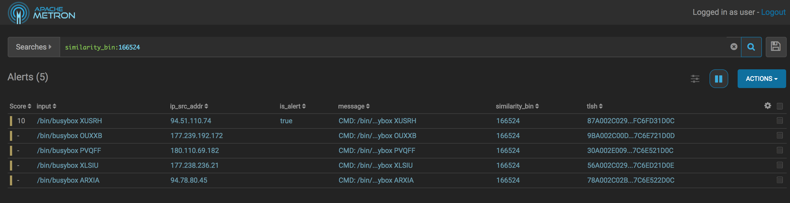

<!--
Licensed to the Apache Software Foundation (ASF) under one
or more contributor license agreements.  See the NOTICE file
distributed with this work for additional information
regarding copyright ownership.  The ASF licenses this file
to you under the Apache License, Version 2.0 (the
"License"); you may not use this file except in compliance
with the License.  You may obtain a copy of the License at

    http://www.apache.org/licenses/LICENSE-2.0

Unless required by applicable law or agreed to in writing, software
distributed under the License is distributed on an "AS IS" BASIS,
WITHOUT WARRANTIES OR CONDITIONS OF ANY KIND, either express or implied.
See the License for the specific language governing permissions and
limitations under the License.
-->
# Problem Statement

Having a forensic hash, such as [TLSH](https://github.com/trendmicro/tlsh), is a useful tool in cybersecurity.
In short, the notion is that semantically similar documents should hash
to a value which also similar.  Contrast this with your standard
cryptographic hashes, such as SHA and MD, where small deviations in the
input data will yield large deviations in the hashes.

The traditional use-case is to hash input documents or binaries and
compare against a known blacklist of malicious hashes.  A sufficiently
similar hash will indicate a match.  This will avoid malicious parties
fuzzing input data to avoid detection.

While this is interesting, it still requires metric-space searches in a blacklist.
I envisioned a slightly more interesting streaming use-case of
on-the-fly clustering of data.  While the TLSH hashes created do not
necessarily hash to precisely the same value on similar documents, more
traditional non-forensic hashes *do* collide when sufficiently similar.
Namely, the Hamming distance
[LSH](https://en.wikipedia.org/wiki/Locality-sensitive_hashing#Bit_sampling_for_Hamming_distance)
applied to the TLSH hash would give us a way to bin semantic hashes such
that similar hashes (by hamming distance) have the same hash.

Inspired by a good
[talk](https://github.com/fluenda/dataworks_summit_iot_botnet/blob/master/dws-fucs-lopresto.pdf) by Andy
LoPresto and Andre Fucs de Miranda from Apache NiFi, we will proceed to
take logs from the Cowrie honeypot and compute TLSH hashes and semantic
bins so that users can easily find similarly malicious activity to known
threats in logs.

Consider the following excerpts from the Cowrie logs the authors above
have shared:
```
{
  "eventid": "cowrie.command.success"
, "timestamp": "2017-09-18T11:45:25.028091Z"
, "message": "Command found: /bin/busybox LSUCT"
, "system": "CowrieTelnetTransport,787,121.237.129.163"
, "isError": 0
, "src_ip": "121.237.129.163"
, "session": "21caf72c6358"
, "input": "/bin/busybox LSUCT"
, "sensor": "a927e8b28666"
}
```
and
```
{
  "eventid": "cowrie.command.success"
, "timestamp": "2017-09-17T04:06:39.673206Z"
, "message": "Command found: /bin/busybox XUSRH"
, "system": "CowrieTelnetTransport,93,94.51.110.74"
, "isError": 0
, "src_ip": "94.51.110.74"
, "session": "4c047bbc016c"
, "input": "/bin/busybox XUSRH"
, "sensor": "a927e8b28666"
}
```

You will note the `/bin/busybox` call with a random selection afterwards.  
Excerpting from an analysis of an IOT exploit
[here](https://isc.sans.edu/diary/21543):
```
The use of the command "busybox ECCHI" appears to have two functions.
First of all, cowrie, and more "complete" Linux distrubtions then
commonly found on DVRs will respond with a help screen if a wrong module
is used. So this way, "ECCHI" can be used to detect honeypots and
irrelevant systems if the reply isn't simply "ECCHI: applet not found".
Secondly, the command is used as a market to indicate that the prior
command finished. Later, the attacker adds "/bin/busybox ECCHI" at the
end of each line, following the actual command to be executed.
```

We have a few options at our disposal:
* If we were merely filtering and alerting on the execution of `/bin/busybox` we would include false positives.  
* If we looked at `/bin/busybox XUSRH`, we'd miss many attempts with a *different* value as `XUSRH` is able to be swapped out for another random sequence to foil overly strict rules.
* If we looked for `/bin/busybox *` then we'd capture this scenario well, but it'd be nice to be able to not be specific to detecting the `/bin/busybox` style of exploits.

Indeed, this is precisely what semantic hashing and binning allows us,
the ability to group by semantic similarity without being too specific
about what we mean of as "semantic" or "similar".  We want to cast a
wide net, but not pull back every fish in the sea.

For this demonstration, we will 
* ingest some 400 cowrie records 
* tag records from an IP blacklist for known malicious actors
* use the alerts UI to investigate and find similar attacks.

## Preliminaries

We assume that the following environment variables are set:
* `METRON_HOME` - the home directory for metron
* `ZOOKEEPER` - The zookeeper quorum (comma separated with port specified: e.g. `node1:2181` for full-dev)
* `BROKERLIST` - The Kafka broker list (comma separated with port specified: e.g. `node1:6667` for full-dev)
* `ES_HOST` - The elasticsearch master (and port) e.g. `node1:9200` for full-dev.

Also, this does not assume that you are using a kerberized cluster.  If you are, then the parser start command will adjust slightly to include the security protocol.

Before editing configurations, be sure to pull the configs from zookeeper locally via
```
$METRON_HOME/bin/zk_load_configs.sh --mode PULL -z $ZOOKEEPER -o $METRON_HOME/config/zookeeper/ -f
```

## Setting up the Data

First we must set up the cowrie log data in our cluster's access node.

* Download the data from the github repository for the talk mentioned above [here](https://github.com/fluenda/dataworks_summit_iot_botnet/blob/master/180424243034750.tar.gz). Ensure that's moved into your home directory on the metron node.
* Create a directory called `cowrie` in ~ and untar the tarball into that
  directory via:
```
mkdir ~/cowrie
cd ~/cowrie
tar xzvf ~/180424243034750.tar.gz
```

## Configuring the Parser

The Cowrie data is coming in as simple JSON blobs, so it's easy to
parse.  We really just need to adjust the timestamp and a few fields and
we have valid data.

* Create `$METRON_HOME/config/zookeeper/parsers/cowrie.json` with the following content:
```
{
  "parserClassName":"org.apache.metron.parsers.json.JSONMapParser",
  "sensorTopic":"cowrie",
  "fieldTransformations" : [
    {
    "transformation" : "STELLAR"
   ,"output" : [ "timestamp"]
   ,"config" : {
      "timestamp" : "TO_EPOCH_TIMESTAMP( timestamp, 'yyyy-MM-dd\\'T\\'HH:mm:ss.SSS')"
               }
    }
                           ]

}

```

Before we start, we will want to install ES template mappings so ES knows how to interpret our fields:
```
curl -XPUT $ES_HOST'/_template/cowrie_index' -d '
{
  "template": "cowrie_index*",
  "mappings": {
    "cowrie_doc": {
        "dynamic_templates": [
        {
          "geo_location_point": {
            "match": "enrichments:geo:*:location_point",
            "match_mapping_type": "*",
            "mapping": {
              "type": "geo_point"
            }
          }
        },
        {
          "geo_country": {
            "match": "enrichments:geo:*:country",
            "match_mapping_type": "*",
            "mapping": {
              "type": "keyword"
            }
          }
        },
        {
          "geo_city": {
            "match": "enrichments:geo:*:city",
            "match_mapping_type": "*",
            "mapping": {
              "type": "keyword"
            }
          }
        },
        {
          "geo_location_id": {
            "match": "enrichments:geo:*:locID",
            "match_mapping_type": "*",
            "mapping": {
              "type": "keyword"
            }
          }
        },
        {
          "geo_dma_code": {
            "match": "enrichments:geo:*:dmaCode",
            "match_mapping_type": "*",
            "mapping": {
              "type": "keyword"
            }
          }
        },
        {
          "geo_postal_code": {
            "match": "enrichments:geo:*:postalCode",
            "match_mapping_type": "*",
            "mapping": {
              "type": "keyword"
            }
          }
        },
        {
          "geo_latitude": {
            "match": "enrichments:geo:*:latitude",
            "match_mapping_type": "*",
            "mapping": {
              "type": "float"
            }
          }
        },
        {
          "geo_longitude": {
            "match": "enrichments:geo:*:longitude",
            "match_mapping_type": "*",
            "mapping": {
              "type": "float"
            }
          }
        },
        {
          "timestamps": {
            "match": "*:ts",
            "match_mapping_type": "*",
            "mapping": {
              "type": "date",
              "format": "epoch_millis"
            }
          }
        },
        {
          "threat_triage_score": {
            "mapping": {
              "type": "float"
            },
            "match": "threat:triage:*score",
            "match_mapping_type": "*"
          }
        },
        {
          "threat_triage_reason": {
            "mapping": {
              "type": "text",
              "fielddata": "true"
            },
            "match": "threat:triage:rules:*:reason",
            "match_mapping_type": "*"
          }
        },
        {
          "threat_triage_name": {
            "mapping": {
              "type": "text",
              "fielddata": "true"
            },
            "match": "threat:triage:rules:*:name",
            "match_mapping_type": "*"
          }
        }
        ],
        "properties" : {
          "blacklisted" : {
            "type" : "boolean"
          },
          "compCS" : {
            "type" : "keyword"
          },
          "data" : {
            "type" : "keyword"
          },
          "dst_ip" : {
            "type" : "keyword"
          },
          "dst_port" : {
            "type" : "long"
          },
          "duration" : {
            "type" : "double"
          },
          "encCS" : {
            "type" : "keyword"
          },
          "eventid" : {
            "type" : "keyword"
          },
          "guid" : {
            "type" : "keyword"
          },
          "input" : {
            "type" : "keyword"
          },
          "isError" : {
            "type" : "long"
          },
          "is_alert" : {
            "type" : "keyword"
          },
          "kexAlgs" : {
            "type" : "keyword"
          },
          "keyAlgs" : {
            "type" : "keyword"
          },
          "macCS" : {
            "type" : "keyword"
          },
          "message" : {
            "type" : "keyword"
          },
          "original_keyword" : {
            "type" : "keyword"
          },
          "password" : {
            "type" : "keyword"
          },
          "sensor" : {
            "type" : "keyword"
          },
          "session" : {
            "type" : "keyword"
          },
          "similarity_bin" : {
            "type" : "keyword"
          },
          "size" : {
            "type" : "long"
          },
          "source:type" : {
            "type" : "keyword"
          },
          "src_ip" : {
            "type" : "keyword"
          },
          "src_port" : {
            "type" : "long"
          },
          "system" : {
            "type" : "keyword"
          },
          "timestamp": {
            "type": "date",
            "format": "epoch_millis"
          },
          "tlsh" : {
            "type" : "keyword"
          },
          "ttylog" : {
            "type" : "keyword"
          },
          "username" : {
            "type" : "keyword"
          },
          "version" : {
            "type" : "keyword"
          },
          "metron_alert" : {
            "type" : "nested"
          }
        }
     }
  }
}
'
```

* Create the `cowrie` kafka topic via:
```
/usr/hdp/current/kafka-broker/bin/kafka-topics.sh --zookeeper $ZOOKEEPER --create --topic cowrie --partitions 1 --replication-factor 1
```

## Import the Blacklist

Here, to build out a scenario, we will assume that we have a blacklist of known malicious hosts.  For our purposes, we'll choose 
one particular host IP to be malicious.

* Create `~/blacklist.csv` to contain the following:
```
94.51.110.74
```
* Create `~/blacklist_extractor.json` to contain the following:
```
{
  "config" : {
    "columns" : {
       "ip" : 0
    },
    "indicator_column" : "ip",
    "type" : "blacklist",
    "separator" : ","
  },
  "extractor" : "CSV"
}
```
* Import the data `$METRON_HOME/bin/flatfile_loader.sh -i ~/blacklist.csv -t threatintel -c t -e ~/blacklist_extractor.json`

This will create a new enrichment type "blacklist" with a single entry "94.51.110.74".

## Configure Enrichments

We will want to do the following:
* Add enrichments to faciliate binning
  * Construct what we consider to be a sufficient representation of the thing we want to cluster.  For our purposes, this is centered around the input command, so that would be:
    * The `message` field
    * The `input` field
    * The `isError` field
  * Compute the TLSH hash of this representation, called `tlsh`
  * Compute the locality sensitive hash of the TLSH hash suitable for binning, called `similarity_bin`
* Set up the threat intelligence to use the blacklist
  * Set an alert if the message is from an IP address in the threat intelligence blacklist.
  * Score blacklisted messages with `10`.  In production, this would be more complex.

Now, we can create the enrichments thusly by creating `$METRON_HOME/config/zookeeper/enrichments/cowrie.json` with the following content:
```
{
  "enrichment": {
    "fieldMap": {
      "stellar" : {
        "config" : [
          "characteristic_rep := JOIN([ 'message', exists(message)?message:'', 'input', exists(input)?input:'', 'isError', exists(isError)?isError:''], '|')",
          "forensic_hashes := HASH(characteristic_rep, 'tlsh', { 'hashes' : 16, 'bucketSize' : 128 })",
          "similarity_bin := MAP_GET('tlsh_bin', forensic_hashes)",
          "tlsh := MAP_GET('tlsh', forensic_hashes)",
          "forensic_hashes := null",
          "characteristic_rep := null"
        ]
      }
   }
  ,"fieldToTypeMap": { }
  },
  "threatIntel": {
    "fieldMap": {
      "stellar" : {
        "config" : [
          "blacklisted := ENRICHMENT_EXISTS( 'blacklist', src_ip, 'threatintel', 't')",
          "is_alert := is_alert || blacklisted"
        ]
      }

    },
    "fieldToTypeMap": { },
    "triageConfig" : {
      "riskLevelRules" : [
        {
          "name" : "Blacklisted Host",
          "comment" : "Determine if a host is blacklisted",
          "rule" : "blacklisted != null && blacklisted",
          "score" : 10,
          "reason" : "FORMAT('IP %s is blacklisted', src_ip)"
        }
      ],
      "aggregator" : "MAX"
    }
  }
}
```

### A Note About Similarity Hashes and TLSH

Notice that we have specified a number of hash functions of `16` when constructing the similarity bin.  
I arrived at that by trial and error, which is not always tenable, frankly.  What is more sensible is 
likely to construct *multiple* similarity bins of size `8`, `16`, `32` at minimum.
* The smaller the number of hashes, the more loose the notion of similarity (more possibly dissimilar things would get grouped together).  
* The larger the number of hashes, the more strict (similar things may not be grouped together).

## Create the Data Loader

We want to pull a snapshot of the cowrie logs, so create `~/load_data.sh` with the following content:
```
COWRIE_HOME=~/cowrie
for i in cowrie.1626302-1636522.json cowrie.16879981-16892488.json cowrie.21312194-21331475.json cowrie.698260-710913.json cowrie.762933-772239.json cowrie.929866-939552.json cowrie.1246880-1248235.json cowrie.19285959-19295444.json cowrie.16542668-16581213.json cowrie.5849832-5871517.json cowrie.6607473-6609163.json;do
  echo $i
  cat $COWRIE_HOME/$i | /usr/hdp/current/kafka-broker/bin/kafka-console-producer.sh --broker-list $BROKERLIST --topic cowrie
  sleep 2
done
```
* Set the `+x` bit on the executable via:
```
chmod +x ~/load_data.sh
```

## Execute Demonstration

From here, we've set up our configuration and can push the configs:
* Push the configs to zookeeper via
```
$METRON_HOME/bin/zk_load_configs.sh --mode PUSH -z $ZOOKEEPER -i $METRON_HOME/config/zookeeper/
```
* Start the parser via:
```
$METRON_HOME/bin/start_parser_topology.sh -k $BROKERLIST -z $ZOOKEEPER -s cowrie
```
* Push cowrie data into the `cowrie` topic via
```
~/load_data.sh
```

Once this data is loaded, we can use the Alerts UI, starting from known malicious actors, to find others doing similar things.

* First we can look at the alerts directly and find an instance of our `/bin/busybox` activity:


* We can now pivot and look for instances of messages with the same `semantic_hash` but who are *not* alerts:


As you can see, we have found a few more malicious actors:
* 177.239.192.172
* 180.110.69.182
* 177.238.236.21
* 94.78.80.45

Now we can look at *other* things that they're doing to build and refine our definition of what an alert is without resorting to hard-coding of rules.  Note that nothing in our enrichments actually used the string `busybox`, so this is a more general purpose way of navigating similar things.

### Version Info

Verified against:

- METRON_VERSION=0.5.0
- ELASTIC_VERSION=5.6.2

