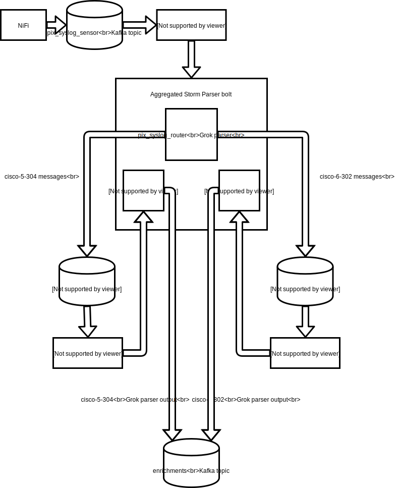

<!--
Licensed to the Apache Software Foundation (ASF) under one
or more contributor license agreements.  See the NOTICE file
distributed with this work for additional information
regarding copyright ownership.  The ASF licenses this file
to you under the Apache License, Version 2.0 (the
"License"); you may not use this file except in compliance
with the License.  You may obtain a copy of the License at

    http://www.apache.org/licenses/LICENSE-2.0

Unless required by applicable law or agreed to in writing, software
distributed under the License is distributed on an "AS IS" BASIS,
WITHOUT WARRANTIES OR CONDITIONS OF ANY KIND, either express or implied.
See the License for the specific language governing permissions and
limitations under the License.
-->
# Problem Statement

Aggregating many different types sensors into a single data source (e.g.
syslog) and ingesting that aggregate sensor into Metron is a common pattern.  It 
is not obvious precisely how to manage these types of aggregate sensors 
as they require two-pass parsing.  This document will walk through an
example of supporting this kind of multi-pass ingest.

Multi-pass parser involves the following requirements:
* The enveloping parser (e.g. the aggregation format such as syslog or
  plain CSV) may contain metadata which should be ingested along with the data.
* The enveloping sensor contains many different sensor types

# High Level Solution


At a high level, we continue to maintain the architectural invariant of
a 1-1 relationship between logical sensors and storm topologies.
Eventually this relationship may become more complex, but at the moment
the approach is to construct a routing parser which will have two
responsibilities:
* Parse the envelope (e.g. syslog data) and extract any metadata fields
  from the envelope to pass along
* Route the unfolded data to the appropriate kafka topic associated with
  the enveloped sensor data

Because the data emitted from the routing parser is just like any data
emitted from any other parser, in that it is a JSON blob like any
data emitted from any parser, we will need to adjust the downstream
parsers to extract the enveloped data from the JSON blob and treat it as
the data to parse.

# Example

## Preliminaries

We assume that the following environment variables are set:
* `METRON_HOME` - the home directory for metron
* `ZOOKEEPER` - The zookeeper quorum (comma separated with port specified: e.g. `node1:2181` for full-dev)
* `BROKERLIST` - The Kafka broker list (comma separated with port specified: e.g. `node1:6667` for full-dev)
* `ES_HOST` - The elasticsearch master (and port) e.g. `node1:9200` for full-dev.

Before editing configurations, be sure to pull the configs from zookeeper locally via
```
$METRON_HOME/bin/zk_load_configs.sh --mode PULL -z $ZOOKEEPER -o $METRON_HOME/config/zookeeper/ -f
```


## The Scenario

Consider the following situation, we have some logs from a Cisco PIX
device that we would like to ingest.  The format is syslog, but multiple
scenarios exist in the same log file.  Specificaly, let's consider the
sample logs
[here](http://www.monitorware.com/en/logsamples/cisco-pix-61(2).php).

The log lines in general have the following components:
* A timestamp
* A message type tag
* The message payload that is dependent upon the tag

Let's consider two types of messages that we'd like to parse:
* Tag `6-302*` which are connection creation and teardown messages e.g. `Built UDP connection for faddr 198.207.223.240/53337 gaddr 10.0.0.187/53 laddr 192.168.0.2/53`
* Tag `5-304*` which are URL access events e.g. `192.168.0.2 Accessed URL 66.102.9.99:/`

A couple things are apparent from this:
* The formats we care about are easy to represent in grok, but are very
  different and logically represent very different sensors.
* The syslog loglines output by this device has many types of events that I do not care
  about (yet).

We will proceed to create 3 separate parsers:
* A `pix_syslog_router` parser which will:
  * Parse the timestamp field
  * Parse the payload into a field called `data`
  * Parse the tag into a field called `pix_type`
  * Route the enveloped messages to the appropriate kafka topic
    based on the tag
* A `cisco-6-302` and `cisco-5-304` parser which will append to the existing fields from
  the `pix_syslog_router` the sensor specific fields based on the tag type.

## Cisco PIX Grok Patterns
In order to assist in these parsers, we're going to accumulate some grok
expressions which will help us deal with these various parsers.

* Open a file `~/cisco_patterns` and place the following in there
```
CISCO_ACTION Built|Teardown|Deny|Denied|denied|requested|permitted|denied by ACL|discarded|est-allowed|Dropping|created|deleted
CISCO_REASON Duplicate TCP SYN|Failed to locate egress interface|Invalid transport field|No matching connection|DNS Response|DNS Query|(?:%{WORD}\s*)*
CISCO_DIRECTION Inbound|inbound|Outbound|outbound
CISCOFW302020_302021 %{CISCO_ACTION:action}(?:%{CISCO_DIRECTION:direction})? %{WORD:protocol} connection %{GREEDYDATA:ignore} faddr %{IP:ip_dst_addr}/%{INT:icmp_seq_num}(?:\(%{DATA:fwuser}\))? gaddr %{IP:ip_src_xlated}/%{INT:icmp_code_xlated} laddr %{IP:ip_src_addr}/%{INT:icmp_code}( \(%{DATA:user}\))?
ACCESSED %{URIHOST:ip_src_addr} Accessed URL %{IP:ip_dst_addr}:%{URIPATHPARAM:uri_path}
CISCO_PIX %{GREEDYDATA:timestamp}: %PIX-%{NOTSPACE:pix_type}: %{GREEDYDATA:data}
```
* Place this pattern in HDFS at `/tmp/cisco_patterns` via `hadoop fs -put ~/cisco_patterns /tmp`
  * NOTE: In production, we'd have more battle hardened patterns as well as place them in a more sensible location.

## The `pix_syslog_router` Parser

* Create the `pix_syslog_router` kafka topic via:
```
/usr/hdp/current/kafka-broker/bin/kafka-topics.sh --zookeeper $ZOOKEEPER --create --topic pix_syslog_router --partitions 1 --replication-factor 1
```
* Create the `pix_syslog_router` parser by opening `$METRON_HOME/config/zookeeper/parsers/pix_syslog_router.json` and placing the following:
```
{
   "parserClassName" : "org.apache.metron.parsers.GrokParser"
  ,"sensorTopic" : "pix_syslog_router"
  , "parserConfig": {
     "grokPath": "/tmp/cisco_patterns",
     "batchSize" : 1,
     "patternLabel": "CISCO_PIX",
     "timestampField": "timestamp",
     "timeFields" : [ "timestamp" ],
     "dateFormat" : "MMM dd yyyy HH:mm:ss",
     "kafka.topicField" : "logical_source_type"
   }
  ,"fieldTransformations" : [
    {
     "transformation" : "REGEX_SELECT"
    ,"input" :  "pix_type"
    ,"output" :  "logical_source_type"
    ,"config" : {
      "cisco-6-302" : "^6-302.*",
      "cisco-5-304" : "^5-304.*"
                }
    }
                           ]
}
```
A couple of things to note about this config:
* In the `parserConfig` section, note that we are specifying `kafka.topicField` is `logical_source_field`.  This specifies that the parser will send messages to the topic specified in the `logical_source_type` field.  If the field does not exist, then the message is not sent.
* The `REGEX_SELECT` field transformation sets the `logical_source_type` field based on the value in the `pix_type` field, which recall is our tag.  This will enable us to route the broad category of cisco firewall messages along to the specific parser.


## The `cisco-6-302` Parser

* Create the `cisco-6-302` kafka topic via:
```
/usr/hdp/current/kafka-broker/bin/kafka-topics.sh --zookeeper $ZOOKEEPER --create --topic cisco-6-302 --partitions 1 --replication-factor 1
```
* Create the `cisco-6-302` parser by opening `$METRON_HOME/config/zookeeper/parsers/cisco-6-302.json` and placing the following:
```
{
   "parserClassName" : "org.apache.metron.parsers.GrokParser"
  ,"sensorTopic" : "cisco-6-302"
  ,"rawMessageStrategy" : "ENVELOPE"
  ,"rawMessageStrategyConfig" : {
      "messageField" : "data",
      "metadataPrefix" : ""
  }
  , "parserConfig": {
     "grokPath": "/tmp/cisco_patterns",
     "batchSize" : 1,
     "patternLabel": "CISCOFW302020_302021"
   }
}
```

Note a couple of things:
* We are specifying the `rawMessageStrategy` to be `ENVELOPE` to indicate that it is not a straight data feed, but rather it's enveloped in a JSON map (i.e. the output of the `pix_syslog_router)
* Because this is enveloped, we must specify the field which contains the actual raw data by setting `messageField` in `rawMessageStrategyConfig`
* You may be wondering why we specify `metadataPrefix` to be empty string.  We want some of the fields in the enveloped message to be merged in without prefix.  Most specifically, we want the `timestamp` field.  By default, the prefix is `metron.metadata`.

## The `cisco-5-304` Parser

* Create the `cisco-5-304` kafka topic via:
```
/usr/hdp/current/kafka-broker/bin/kafka-topics.sh --zookeeper $ZOOKEEPER --create --topic cisco-5-304 --partitions 1 --replication-factor 1
```
* Create the `cisco-5-304` parser by opening `$METRON_HOME/config/zookeeper/parsers/cisco-5-304.json` and placing the following:
```
{
   "parserClassName" : "org.apache.metron.parsers.GrokParser"
  ,"sensorTopic" : "cisco-5-304"
  ,"rawMessageStrategy" : "ENVELOPE"
  ,"rawMessageStrategyConfig" : {
      "messageField" : "data",
      "metadataPrefix" : ""
  }
  , "parserConfig": {
     "grokPath": "/tmp/cisco_patterns",
     "batchSize" : 1,
     "patternLabel": "ACCESSED"
   }
}
```

Mostly the same comments from the previous parser apply here; we are just using a different pattern label.

# Start the Parsers
Now we should start the parsers 
* Push the configs that we've created for the 3 parsers:
```
$METRON_HOME/bin/zk_load_configs.sh --mode PUSH -z $ZOOKEEPER -i $METRON_HOME/config/zookeeper/
```
* Start the `cisco-6-302` parser via 
```
$METRON_HOME/bin/start_parser_topology.sh -k $BROKERLIST -z $ZOOKEEPER -s cisco-6-302 
```
* Start the `cisco-5-304` parser via 
```
$METRON_HOME/bin/start_parser_topology.sh -k $BROKERLIST -z $ZOOKEEPER -s cisco-5-304 
```
* Start the `pix_syslog_router` parser via 
```
$METRON_HOME/bin/start_parser_topology.sh -k $BROKERLIST -z $ZOOKEEPER -s pix_syslog_router
```

# Send Data
* Create a file called `~/data.log` with the sample syslog loglines [here](http://www.monitorware.com/en/logsamples/cisco-pix-61(2).php).
* Send the data in via kafka console producer
```
cat ~/data.log | /usr/hdp/current/kafka-broker/bin/kafka-console-producer.sh --broker-list $BROKERLIST --topic pix_syslog_router
```

You should see indices created for the `cisco-5-304` and `cisco-6-302` data with appropriate fields created for each type.

# Aggregated Parsers with Parser Chaining
Chained parsers can be run as aggregated parsers. These parsers continue to use the sensor specific Kafka topics, and do not do internal routing to the appropriate sensor.

Instead of creating a topology per sensor, all 3 (`pix-syslog-parser`, `cisco-5-304`, and `cisco-6-302`) can be run in a single aggregated parser. It's also possible to aggregate a subset of these parsers (e.g. run `cisco-6-302` as it's own topology, and aggregate the other 2).

The step to start parsers then becomes
```
$METRON_HOME/bin/start_parser_topology.sh -k $BROKERLIST -z $ZOOKEEPER -s cisco-6-302,cisco-5-304,pix_syslog_router
```

The flow through the Storm topology and Kafka topics:

