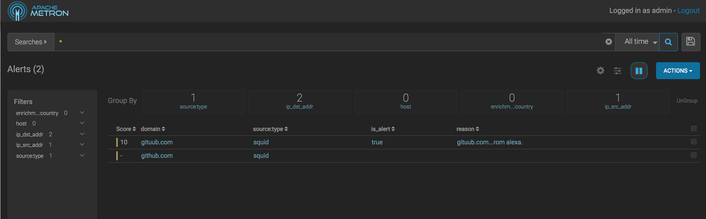
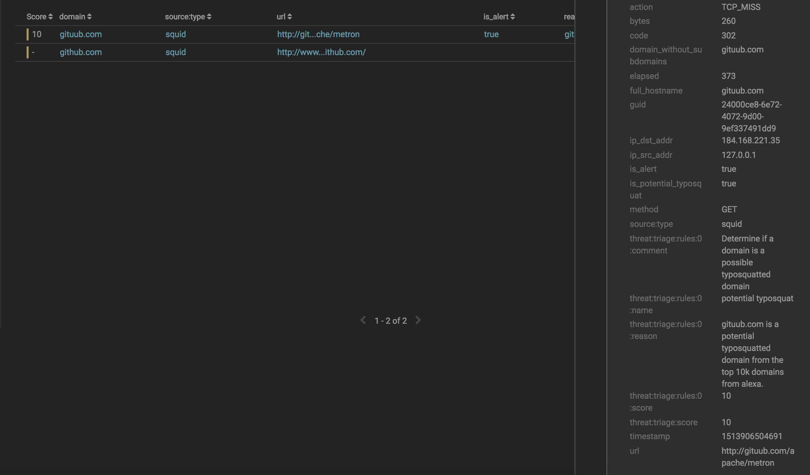

<!--
Licensed to the Apache Software Foundation (ASF) under one
or more contributor license agreements.  See the NOTICE file
distributed with this work for additional information
regarding copyright ownership.  The ASF licenses this file
to you under the Apache License, Version 2.0 (the
"License"); you may not use this file except in compliance
with the License.  You may obtain a copy of the License at

    http://www.apache.org/licenses/LICENSE-2.0

Unless required by applicable law or agreed to in writing, software
distributed under the License is distributed on an "AS IS" BASIS,
WITHOUT WARRANTIES OR CONDITIONS OF ANY KIND, either express or implied.
See the License for the specific language governing permissions and
limitations under the License.
-->
# Problem Statement

[Typosquatting](https://en.wikipedia.org/wiki/Typosquatting) is a form of cybersquatting which relies on
likely typos to trick unsuspecting users to visit possibly malicious URLs.  In the best case, this is a
mischievous joke as in the following RickRoll: [http://www.latlmes.com/breaking/apache-metron-named-best-software-by-asf-1](http://www.latlmes.com/breaking/apache-metron-named-best-software-by-asf-1).
In the worst case, however, it can be overtly malicious as Bitcoin users found out in [2016](https://nakedsecurity.sophos.com/2014/03/24/bitcoin-user-loses-10k-to-typosquatters/) 
when thousands of dollars of Bitcoin was stolen as part of a phishing attack which used typosquatting.

It is therefore of use for us to detect so called typosquatting attacks as they appear over the network.  We
have had for some time, through the flatfile loader and open source typosquatting generation tools such 
as [DNS Twist](https://github.com/elceef/dnstwist), the ability to generated potential typosquatted domains,
import them into HBase and look them up via `ENRICHMENT_EXISTS`.

There are some challenges with this approach, though entirely viable:
* Even for modest numbers of domains, the number of records can grow quite large.  The Top Alexa 10k domains has on the order of 3 million potential typosquatted domains.
* It still requires a network hop if out of cache.

# The Tools Metron Provides

## Bloom Filters

It would be nice to have a local solution for these types of problems that may tradeoff accuracy for better 
locality and space.  Those who have been following the general theme of Metron's analytics philosophy will see
that we are likely in the domain where a probabalistic sketching data structure is in order.  In this case, we
are asking simple existence queries, so a [Bloom Filter](https://en.wikipedia.org/wiki/Bloom_filter) fits 
well here.

In Metron, we have the ability to create, add and merge bloom filters via:
* `BLOOM_INIT( size, fpp)` - Creates a bloom filter to handle `size` number of elements with `fpp` probability of false positives (`0 < fpp < 1`).
* `BLOOM_ADD( filter, object)` - Add an item to an existing bloom filter.
* `BLOOM_MERGE( filters )` - Merge a `filters`, a list of Bloom Filters.

## Typosquatting Domain Generation

Now that we have a suitable data structure, we need a way to generate potential typosquatted domains for a
given domain.  Following the good work of [DNS Twist](https://github.com/elceef/dnstwist), we have ported
their set of typosquatting strategies to Metron:
* Bitsquatting - See [here](http://dinaburg.org/bitsquatting.html)
* Homoglyphs - Substituting characters for ascii or unicode analogues which are visually similar (e.g. `latlmes.com` for `latimes.com` as above)
* Subdomain - Making part of the domain a subdomain (e.g. `am.azon.com`)
* Hyphenation 
* Insertion 
* Addition 
* Omission 
* Repetition 
* Replacement
* Transposition
* Vowel swapping

The Stellar function in Metron is `DOMAIN_TYPOSQUAT( domain )`.  It is recommended to remove the TLD from the 
domain.  You can see it in action here with our rick roll example above:
```
[Stellar]>>> 'latlmes' in DOMAIN_TYPOSQUAT( 'latimes')
true
```

## Generating Summaries

We need a way to generate the summary sketches from flat data for this to work.  This is similar to, but 
somewhat different from, loading flat data into HBase.  Instead of each row in the file being loaded
generating a record in HBase, what we want is for each record to contribute to the summary sketch and at the
end to write out the summary sketch.

For this purpose, we have a new utility `$METRON_HOME/bin/flatfile_summarizer.sh` to accompany 
`$METRON_HOME/bin/flatfile_loader.sh`.  The same extractor config is used, but we have 3 new configuration
options:
* `state_init` - Allows a state object to be initialized.  This is a string, so a single expression is created.  The output of this expression will be available as the `state` variable.  
* `state_update` - Allows a state object to be updated.  This is a map, so you can have temporary variables here.  Note that you can reference the `state` variable from this. 
* `state_merge` - Allows a list of states to be merged. This is a string, so a single expression.  There is a special field called `states` available, which is a list of the states (one per thread).  If this is not in existence, the number of threads is bound to one.

Just as with `flatfile_loader.sh`, you can specify the number of threads (via `-p`) and batch size 
(via `-b`), but now you have the opportunity to specify the output destination (via `-o`) and the output 
mode (via `-om`).
The current output modes are:
* `LOCAL` - The default, to local disk.
* `CONSOLE` - Write the object summarized out to std out.  This is useful to get summary statistics about the data imported. For instance, you could determine how many typosquatted domains there are for the Alexa 10k.
* `HDFS`

## Reading Summaries In-Stream 

These summaries are immutable data and are stored in HDFS.  We want to read them in and cache them for later,
so a new stellar function called `OBJECT_GET( hdfs_path )` will allow you to read the data from HDFS and 
deserialize the data into an object which can be used.  Subsequent calls for the next 24 hours (by default, 
defaults of the cache can be changed in the global config) will be read from the static cache.

For instance, if you have used the `flatfile_summarizer.sh` utility described above to write out an object to 
`/apps/metron/objects/alexa_10k_filter.ser`, you can read and deserialize this object and use the bloom filter
to determine if the domain `goggle` is a typosquatted domain:
```
BLOOM_EXISTS( OBJECT_GET('/apps/metron/objects/alexa_10k_filter.ser'), 'goggle')
```

# Example

In the following demo, we will:
* Generate summary data from the top 10k Alexa domains in a Bloom Filter
* Use this to detect potential typosquatting instances in proxy data

## Preliminaries

We assume that the following environment variables are set:
* `METRON_HOME` - the home directory for metron
* `ZOOKEEPER` - The zookeeper quorum (comma separated with port specified: e.g. `node1:2181` for full-dev)
* `BROKERLIST` - The Kafka broker list (comma separated with port specified: e.g. `node1:6667` for full-dev)
* `ES_HOST` - The elasticsearch master (and port) e.g. `node1:9200` for full-dev.

Also, this does not assume that you are using a kerberized cluster.  If you are, then the parser start command will adjust slightly to include the security protocol.

Before editing configurations, be sure to pull the configs from zookeeper locally via
```
$METRON_HOME/bin/zk_load_configs.sh --mode PULL -z $ZOOKEEPER -o $METRON_HOME/config/zookeeper/ -f
```

If you are doing this on full-dev, I'd recommend stopping existing parsers and the profiler to free up
resources.  You can do this in Ambari.

## Install Squid Proxy

Before starting, we're going to need to install and start squid by executing the following commands:
* `yum install -y squid`
* `service squid start`

## Retrieve Alexa Data

From the Metron access node in `~`, retrieve the 
[Alexa top domains](https://en.wikipedia.org/wiki/Alexa_Internet) data via:
```
cd ~
wget http://s3.amazonaws.com/alexa-static/top-1m.csv.zip
unzip top-1m.csv.zip
head -n 10000 top-1m.csv > top-10k.csv
```

You should now have a file `~/top-10k.csv` which contains the top 10,000 domains as per 
[Alexa](https://en.wikipedia.org/wiki/Alexa_Internet).

## Summarize

### Configure the Bloom Filter

In order to configure the bloom filter, we need to know two things:
1. Roughly how many elements are going into the bloom filter (an upper bound will do)
2. What kind of false positive probability do we want?

Both of these are going to inform how large the bloom filter is going to be.  We can decide 2, but 1 is 
going to require some computation.  Let's use the `CONSOLE` output mode of the `flatfile_summarizer.sh`
to count the number of typosquatted domains across the entire document.

Create a file `~/extractor_count.json` with the following content:
```
{
  "config" : {
    "columns" : {
       "rank" : 0,
       "domain" : 1
    },
    "value_transform" : {
       "domain" : "DOMAIN_REMOVE_TLD(domain)"
    },
    "value_filter" : "LENGTH(domain) > 0",
    "state_init" : "0L",
    "state_update" : {
       "state" : "state + LENGTH( DOMAIN_TYPOSQUAT( domain ))"
                     },
    "state_merge" : "REDUCE(states, (s, x) -> s + x, 0)",
    "separator" : ","
  },
  "extractor" : "CSV"
}
```

In this extractor config we are using the CSV extractor with the following config properties:
* `columns` - Indicates the schema of the CSV.  There are 2 columns, `rank` at the first position and `domain` at the second position.
* `separator` - Use a comma to separate the columns.
* `value_transform` - For each row, transform each `domain` column by removing the TLD.
* `value_filter` - Only consider non-empty domains
* `state_init` - Initialize the state, a long integer, to 0.
* `state_update` - For each row in the CSV, update the state, which is the running partial sum, with the number of typosquatted domains for the domain
* `state_merge` - For each thread, we have a partial sum, we want to merge the partial sums into the total.

We can run this via:
```
$METRON_HOME/bin/flatfile_summarizer.sh -i ~/top-10k.csv -e ~/extractor_count.json -p 5 -om CONSOLE
```

The output should be something like:
```
17/12/22 17:05:19 WARN extractor.TransformFilterExtractorDecorator: Unable to setup zookeeper client - zk_quorum url not provided. **This will limit some Stellar functionality**

Processing /root/top-10k.csv
17/12/22 17:05:20 WARN resolver.BaseFunctionResolver: Using System classloader
Processed 9999 - \
3496552
```
So, we the total number of possible elements in the bloom filter summary, `3,496,552`.

### Generate the Bloom Filter

Now we can generate the bloom filter on HDFS.  As before, we will adapt our previous extractor config to
generate the bloom filter rather than the sum of the typosquatted domains.

Create a file `~/extractor_filter.json` with the following contents:
```
{
  "config" : {
    "columns" : {
       "rank" : 0,
       "domain" : 1
    },
    "value_transform" : {
       "domain" : "DOMAIN_REMOVE_TLD(domain)"
    },
    "value_filter" : "LENGTH(domain) > 0",
    "state_init" : "BLOOM_INIT(3496552, 0.001)",
    "state_update" : {
       "state" : "REDUCE( DOMAIN_TYPOSQUAT( domain ), (s, x) -> BLOOM_ADD(s, x), state)"
                     },
    "state_merge" : "BLOOM_MERGE(states)",
    "separator" : ","
  },
  "extractor" : "CSV"
}
```

Most of the configs are the same, but there are three that are different:
* `state_init` - We have changed our state to be a bloom filter, initialized with 
  * `3496552` - the size calculated in the previous step
  * `0.001` - The false positive probability (`0.1%`)
* `state_update` - Update the bloom filter (the `state` variable) with each typosquatted domain
* `state_merge` - Merge the bloom filters generated per thread into a final, single bloom filter to be written.

Now we can generate the bloom filter in HDFS at `/tmp/reference/alexa10k_filter.ser` via
```
$METRON_HOME/bin/flatfile_summarizer.sh -i ~/top-10k.csv -o /tmp/reference/alexa10k_filter.ser -e ~/extractor_filter.json -p 5 -om HDFS
```

You can try out the object to ensure it functions as expected via the Stellar REPL (`$METRON_HOME/bin/stellar -z $ZOOKEEPER`):
```
[Stellar]>>> BLOOM_EXISTS(OBJECT_GET('/tmp/reference/alexa10k_filter.ser'), 'gogle')
true
[Stellar]>>> BLOOM_EXISTS(OBJECT_GET('/tmp/reference/alexa10k_filter.ser'), 'google')
false
[Stellar]>>> BLOOM_EXISTS(OBJECT_GET('/tmp/reference/alexa10k_filter.ser'), 'github')
false
[Stellar]>>> BLOOM_EXISTS(OBJECT_GET('/tmp/reference/alexa10k_filter.ser'), 'gituub')
true
```
Notice the lag on the first call is more substantial than the subsequent calls as they are pulled from the cache.

## Parser

Start the squid parser via:
* Create the squid topic: `/usr/hdp/current/kafka-broker/bin/kafka-topics.sh --zookeeper $ZOOKEEPER --create --topic squid --partitions 1 --replication-factor 1`
* Start the squid parser: `$METRON_HOME/bin/start_parser_topology.sh -z $ZOOKEEPER -s squid`

## Set up Enrichment, Threat Intel and Threat Triage

Now that we have squid parser running, we should create an enrichment to add a field `is_potential_typosquat`
which determines if the domain is potentially a typosquatted domain.  Furthermore, we should set an alert if 
it's so and triage those messages.

We can do this by creating `$METRON_HOME/config/zookeeper/enrichments/squid.json` with the following content:
```
{
  "enrichment": {
    "fieldMap": {
      "stellar" : {
        "config" : [
          "domain_without_tld := DOMAIN_REMOVE_TLD(domain_without_subdomains)",
          "is_potential_typosquat := BLOOM_EXISTS(OBJECT_GET('/tmp/reference/alexa10k_filter.ser'), domain_without_tld)",
          "domain_without_tld := null"
        ]
      }
   }
  ,"fieldToTypeMap": { }
  },
  "threatIntel": {
    "fieldMap": {
      "stellar" : {
        "config" : [
          "is_alert := is_alert || is_potential_typosquat"
        ]
      }

    },
    "fieldToTypeMap": { },
    "triageConfig" : {
      "riskLevelRules" : [
        {
          "name" : "Alexa 10k Typosquat Bloom",
          "comment" : "Inspect a bloom filter with potentially typosquatted domains from the top Alexa 10k",
          "rule" : "is_potential_typosquat != null && is_potential_typosquat",
          "score" : 10,
          "reason" : "FORMAT('%s is a potential typosquatted domain from the top 10k domains from alexa', domain_without_subdomains)"
        }
      ],
      "aggregator" : "MAX"
    }
  }
}

```

As you can see, following the pattern of enrichments the following are done:
* A new field `is_potential_typosquat` is created which indicates whether the domain sans TLD and subdomains is a typosquatted domain according to our bloom filter of the top 10k Alexa domains
* `is_alert` is updated based on the `is_potential_typosquat` field
* A new threat triage rule is added to give the analyst sufficient context if this alert triggers and a score of 10.

Push the configs via `$METRON_HOME/bin/zk_load_configs.sh -m PUSH -i $METRON_HOME/config/zookeeper -z $ZOOKEEPER`

## Setup Indices

We have to adjust the mappings for the indices we just created to add
the `alert` nested property and ensure each of our properties gets the
right type.  One does not want to rely entirely on elasticsearch to
guess the right types.  We will do that by specifying a template: 
```
curl -XPOST "http://$ES_HOST/_template/squid_index" -d '{
          "template": "squid_index*",
          "mappings": {
             "squid_doc": {
               "dynamic_templates": [
                 {
                   "timestamps": {
                     "match": "*:ts",
                     "match_mapping_type": "*",
                     "mapping": {
                     "type": "date",
                     "format": "epoch_millis"
                     }
                                 }
                 },
                 {
                   "threat_triage_score": {
                     "mapping": {
                       "type": "float"
                     },
                     "match": "threat:triage:*score",
                     "match_mapping_type": "*"
                   }
                 },
                 {
                   "threat_triage_reason": {
                     "mapping": {
                       "type": "text",
                       "fielddata": "true"
                     },
                     "match": "threat:triage:rules:*:reason",
                     "match_mapping_type": "*"
                   }
                 }
               ],
               "properties" : {
                 "action" : {
                   "type" : "text","fielddata" : true
                 },
                 "bytes" : {
                   "type" : "long"
                 },
                 "code" : {
                   "type" : "long"
                 },
                 "domain_without_subdomains" : {
                   "type" : "text","fielddata" : true
                 },
                 "elapsed" : {
                   "type" : "long"
                 },
                 "full_hostname" : {
                   "type" : "text","fielddata" : true
                 },
                 "guid" : {
                   "type" : "keyword"
                 },
                 "ip_dst_addr" : {
                   "type" : "ip"
                 },
                 "ip_src_addr" : {
                   "type" : "ip"
                 },
                 "is_alert" : {
                   "type" : "text","fielddata" : true
                 },
                 "is_potential_typosquat" : {
                   "type" : "boolean"
                 },
                 "method" : {
                   "type" : "text","fielddata" : true
                 },
                 "original_text" : {
                   "type" : "text","fielddata" : true
                 },
                 "source:type" : {
                   "type" : "keyword"
                 },
                 "timestamp" : {
                   "type" : "date",
                   "format": "epoch_millis"
                 },
                 "url" : {
                   "type" : "text","fielddata" : true
                 },
                 "metron_alert" : {
                   "type" : "nested"
                 }
              }
           }
   }
}'
```

## Generate Sample Data

We can now use `squidclient` to visit a regular domain and typosquatted domain and send the data to kafka:
```
squidclient http://www.github.com
squidclient http://gituub.com/apache/metron
cat /var/log/squid/access.log | /usr/hdp/current/kafka-broker/bin/kafka-console-producer.sh --broker-list $BROKERLIST --topic squid
```

## Investigate via the Alerts UI

We should now have data in our elasticsearch indices, so let's investigate via the alerts UI.   
We can visit the Alerts UI (find the link from Ambari if not on full-dev.  If on full-dev, go 
[here](http://node1:4201/alerts-list).

From there you should see the following data from squid with one as an alert and the other not

 

Now, if you drill down into the alert, you can see our fields and the reasons specified

 

### Version Info

Verified against:

- METRON_VERSION=0.5.0
- ELASTIC_VERSION=5.6.2
